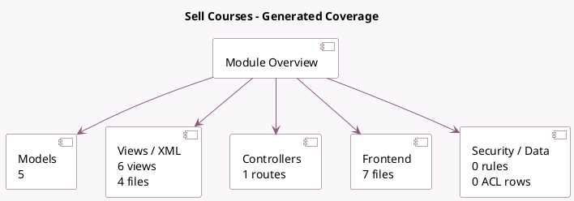

<!-- GENERATED:MODULE -->
---
tags: [odoo, community, module]
---

# Sell Courses

- Scope: Community Addons
- Source: odoo/addons/website_sale_slides
- Dependencies: [[docs/Community Addons/website_slides/website_slides|website_slides]], [[docs/Community Addons/website_sale/website_sale|website_sale]]

## Summary

Sell your courses online

## Generated coverage

- Models: 5
- XML files with UI/data artifacts: 4
- Views: 6
- Actions: 1
- Menus: 1
- Rules (ir.rule): 0
- Access CSV entries: 0
- Controller units: 1
- Frontend asset files: 7

## Module map

## Detail notes

- Models: [[docs/Community Addons/website_sale_slides/Models|Models]] (5)
- Views and XML: [[docs/Community Addons/website_sale_slides/Views|Views]] (4 files)
- Controllers: [[docs/Community Addons/website_sale_slides/Controllers|Controllers]] (1)
- Frontend: [[docs/Community Addons/website_sale_slides/Frontend|Frontend]] (7 files)

## Key models

- `product.product`
- `product.template`
- `sale.order`
- `sale.order.line`
- `slide.channel`

## Navigation

- [[../Community Addons/Community Addons|Back to scope]]
- [[../../docs/docs|Back to docs]]

<!-- GENERATED:MODULE -->

