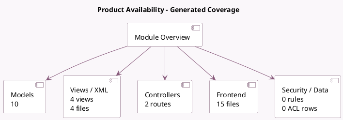

<!-- GENERATED:MODULE -->
---
tags: [odoo, community, module]
---

# Product Availability

- Scope: Community Addons
- Source: odoo/addons/website_sale_stock
- Dependencies: [[docs/Community Addons/website_sale/website_sale|website_sale]], [[docs/Community Addons/sale_stock/sale_stock|sale_stock]], [[docs/Community Addons/stock_delivery/stock_delivery|stock_delivery]]

## Summary

Manage product inventory & availability

## Generated coverage

- Models: 10
- XML files with UI/data artifacts: 4
- Views: 4
- Actions: 0
- Menus: 0
- Rules (ir.rule): 0
- Access CSV entries: 0
- Controller units: 2
- Frontend asset files: 15

## Module map

## Detail notes

- Models: [[docs/Community Addons/website_sale_stock/Models|Models]] (10)
- Views and XML: [[docs/Community Addons/website_sale_stock/Views|Views]] (4 files)
- Controllers: [[docs/Community Addons/website_sale_stock/Controllers|Controllers]] (2)
- Frontend: [[docs/Community Addons/website_sale_stock/Frontend|Frontend]] (15 files)

## Key models

- `product.combo`
- `product.feed`
- `product.product`
- `product.ribbon`
- `product.template`
- `res.config.settings`
- `sale.order`
- `sale.order.line`
- `stock.picking`
- `website`

## Navigation

- [[../Community Addons/Community Addons|Back to scope]]
- [[../../docs/docs|Back to docs]]

<!-- GENERATED:MODULE -->

