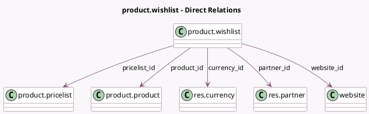

<!-- GENERATED:MODEL -->
---
tags: [odoo, community, generated, model]
---

# product.wishlist

- Module: [[docs/Community Addons/website_sale_wishlist/website_sale_wishlist|website_sale_wishlist]]
- Scope: Community Addons
- Defined in module: yes
- Source files: `models/product_wishlist.py`
- Python classes: `ProductWishlist`
- Description: Product Wishlist

## Field footprint

- Detected fields: 7
- Field types: `Boolean` x 1, `Many2one` x 5, `Monetary` x 1
- Relation fields: 5

## Sample fields

- `active`: `Boolean`
- `currency_id`: `Many2one` (comodel `res.currency`, related `website_id.currency_id`)
- `partner_id`: `Many2one` (comodel `res.partner`)
- `price`: `Monetary`
- `pricelist_id`: `Many2one` (comodel `product.pricelist`)
- `product_id`: `Many2one` (comodel `product.product`)
- `website_id`: `Many2one` (comodel `website`)

## Method hints

- Detected methods: 4
- Action methods: none
- Compute methods: none
- Onchange methods: none

## Direct relation diagram

## Navigation

- **Parent:** [[docs/Community Addons/website_sale_wishlist/Models]]

<!-- GENERATED:MODEL -->
