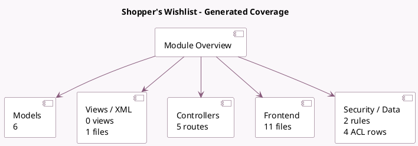

<!-- GENERATED:MODULE -->
---
tags: [odoo, community, module]
---

# Shopper's Wishlist

- Scope: Community Addons
- Source: odoo/addons/website_sale_wishlist
- Dependencies: [[docs/Community Addons/website_sale/website_sale|website_sale]]

## Summary

Allow shoppers to enlist products

## Generated coverage

- Models: 6
- XML files with UI/data artifacts: 1
- Views: 0
- Actions: 0
- Menus: 0
- Rules (ir.rule): 2
- Access CSV entries: 4
- Controller units: 2
- Frontend asset files: 11

## Module map

## Detail notes

- Models: [[docs/Community Addons/website_sale_wishlist/Models|Models]] (6)
- Views and XML: [[docs/Community Addons/website_sale_wishlist/Views|Views]] (1 files)
- Controllers: [[docs/Community Addons/website_sale_wishlist/Controllers|Controllers]] (2)
- Frontend: [[docs/Community Addons/website_sale_wishlist/Frontend|Frontend]] (11 files)

## Key models

- `product.product`
- `product.template`
- `product.wishlist`
- `res.partner`
- `res.users`
- `website`

## Navigation

- [[../Community Addons/Community Addons|Back to scope]]
- [[../../docs/docs|Back to docs]]

<!-- GENERATED:MODULE -->

