<!-- GENERATED:MODEL -->
---
tags: [odoo, community, generated, model]
---

# res.partner

- Module: [[docs/Community Addons/website_slides/website_slides|website_slides]]
- Scope: Community Addons
- Defined in module: extension only
- Source files: `models/res_partner.py`
- Python classes: `ResPartner`

## Field footprint

- Detected fields: 4
- Field types: `Integer` x 2, `Many2many` x 1, `One2many` x 1
- Relation fields: 2

## Sample fields

- `slide_channel_company_count`: `Integer` (comodel `Company Course Count`, compute `_compute_slide_channel_company_count`)
- `slide_channel_completed_ids`: `One2many` (comodel `slide.channel`, compute `_compute_slide_channel_values`)
- `slide_channel_count`: `Integer` (comodel `Course Count`, compute `_compute_slide_channel_values`)
- `slide_channel_ids`: `Many2many` (comodel `slide.channel`, compute `_compute_slide_channel_values`)

## Method hints

- Detected methods: 5
- Action methods: `action_view_courses`
- Compute methods: `_compute_slide_channel_company_count`, `_compute_slide_channel_values`
- Onchange methods: none

## Direct relation diagram

```plantuml
@startuml
!define ODOO_COLOR_PRIMARY #714B67
!define ODOO_COLOR_ACCENT #875A7B
!define ODOO_COLOR_BG #FAF7FA

skinparam backgroundColor ODOO_COLOR_BG
skinparam defaultTextAlignment left
skinparam ArrowColor ODOO_COLOR_ACCENT
skinparam ClassBackgroundColor white
skinparam ClassBorderColor ODOO_COLOR_PRIMARY
skinparam ComponentBackgroundColor white
skinparam ComponentBorderColor ODOO_COLOR_PRIMARY
skinparam NoteBackgroundColor #FFF8FF
skinparam NoteBorderColor ODOO_COLOR_ACCENT
skinparam SequenceLifeLineBorderColor ODOO_COLOR_ACCENT
skinparam SequenceLifeLineBackgroundColor #FFFFFF
skinparam SequenceParticipantBorderColor ODOO_COLOR_PRIMARY
skinparam SequenceParticipantBackgroundColor #FFFFFF
skinparam sequence {
  ArrowColor ODOO_COLOR_ACCENT
  ActorBorderColor ODOO_COLOR_PRIMARY
}
title res.partner - Direct Relations
class "res.partner" as res_partner
class "slide.channel" as slide_channel
res_partner .. slide_channel : slide_channel_ids
res_partner --|> slide_channel : slide_channel_completed_ids
@enduml
```

## Navigation

- **Parent:** [[docs/Community Addons/website_slides/Models]]

<!-- GENERATED:MODEL -->
