<!-- GENERATED:MODEL -->
---
tags: [odoo, community, generated, model]
---

# slide.channel

- Module: [[docs/Community Addons/website_slides/website_slides|website_slides]]
- Scope: Community Addons
- Defined in module: yes
- Source files: `models/slide_channel.py`
- Python classes: `SlideChannel`
- Description: Course
- Inherits: `image.mixin`, `mail.activity.mixin`, `rating.mixin`, `website.cover_properties.mixin`, `website.published.multi.mixin`, `website.searchable.mixin`, and 1 more

## Field footprint

- Detected fields: 66
- Field types: `Boolean` x 13, `Char` x 3, `Date` x 1, `Float` x 2, `Html` x 4, `Integer` x 21, `Many2many` x 6, `Many2one` x 6, `One2many` x 6, `Selection` x 4
- Relation fields: 18

## Sample fields

- `access_token`: `Char` (comodel `Security Token`)
- `active`: `Boolean`
- `allow_comment`: `Boolean` (comodel `Allow rating on Course`)
- `can_comment`: `Boolean` (comodel `Can Comment`, compute `_compute_action_rights`)
- `can_review`: `Boolean` (comodel `Can Review`, compute `_compute_action_rights`)
- `can_upload`: `Boolean` (comodel `Can Upload`, compute `_compute_can_upload`)
- `can_vote`: `Boolean` (comodel `Can Vote`, compute `_compute_action_rights`)
- `channel_partner_all_ids`: `One2many` (comodel `slide.channel.partner`)
- `channel_partner_ids`: `One2many` (comodel `slide.channel.partner`)
- `channel_type`: `Selection`
- `color`: `Integer` (comodel `Color Index`)
- `completed`: `Boolean` (comodel `Done`, compute `_compute_user_statistics`)
- `completed_template_id`: `Many2one` (comodel `mail.template`)
- `completion`: `Integer` (comodel `Completion`, compute `_compute_user_statistics`)
- `description`: `Html` (comodel `Description`)
- `description_html`: `Html` (comodel `Detailed Description`)
- `description_short`: `Html` (comodel `Short Description`)
- `enroll`: `Selection` (compute `_compute_enroll`, store `True`)
- `enroll_group_ids`: `Many2many` (comodel `res.groups`)
- `enroll_msg`: `Html` (comodel `Enroll Message`)

## Method hints

- Detected methods: 65
- Action methods: `action_archive`, `action_channel_enroll`, `action_channel_invite`, `action_grant_access`, `action_redirect_to_completed_members`, `action_redirect_to_engaged_members`, `action_redirect_to_invited_members`, `action_redirect_to_members`, and 5 more
- Compute methods: `_compute_action_rights`, `_compute_can_publish`, `_compute_can_upload`, `_compute_category_and_slide_ids`, `_compute_enroll`, `_compute_has_requested_access`, `_compute_is_visible`, `_compute_members_counts`, and 11 more
- Onchange methods: none

## Direct relation diagram

```plantuml
@startuml
!define ODOO_COLOR_PRIMARY #714B67
!define ODOO_COLOR_ACCENT #875A7B
!define ODOO_COLOR_BG #FAF7FA

skinparam backgroundColor ODOO_COLOR_BG
skinparam defaultTextAlignment left
skinparam ArrowColor ODOO_COLOR_ACCENT
skinparam ClassBackgroundColor white
skinparam ClassBorderColor ODOO_COLOR_PRIMARY
skinparam ComponentBackgroundColor white
skinparam ComponentBorderColor ODOO_COLOR_PRIMARY
skinparam NoteBackgroundColor #FFF8FF
skinparam NoteBorderColor ODOO_COLOR_ACCENT
skinparam SequenceLifeLineBorderColor ODOO_COLOR_ACCENT
skinparam SequenceLifeLineBackgroundColor #FFFFFF
skinparam SequenceParticipantBorderColor ODOO_COLOR_PRIMARY
skinparam SequenceParticipantBackgroundColor #FFFFFF
skinparam sequence {
  ArrowColor ODOO_COLOR_ACCENT
  ActorBorderColor ODOO_COLOR_PRIMARY
}
title slide.channel - Direct Relations
class "slide.channel" as slide_channel
class "mail.template" as mail_template
class "res.groups" as res_groups
class "res.partner" as res_partner
class "res.users" as res_users
class "slide.channel" as slide_channel
class "slide.channel.partner" as slide_channel_partner
class "slide.channel.tag" as slide_channel_tag
class "slide.slide" as slide_slide
class "slide.slide.partner" as slide_slide_partner
slide_channel --> res_users : user_id
slide_channel .. slide_channel_tag : tag_ids
slide_channel --|> slide_slide : slide_ids
slide_channel --|> slide_slide : slide_content_ids
slide_channel --|> slide_slide : slide_category_ids
slide_channel --|> slide_slide_partner : slide_partner_ids
slide_channel --> slide_slide : promoted_slide_id
slide_channel --> mail_template : publish_template_id
slide_channel --> mail_template : share_channel_template_id
slide_channel --> mail_template : share_slide_template_id
slide_channel --> mail_template : completed_template_id
slide_channel .. res_groups : enroll_group_ids
slide_channel .. res_groups : upload_group_ids
slide_channel --|> slide_channel_partner : channel_partner_ids
slide_channel --|> slide_channel_partner : channel_partner_all_ids
slide_channel .. res_partner : partner_ids
slide_channel .. slide_channel : prerequisite_channel_ids
slide_channel .. slide_channel : prerequisite_of_channel_ids
@enduml
```

## Navigation

- **Parent:** [[docs/Community Addons/website_slides/Models]]

<!-- GENERATED:MODEL -->
