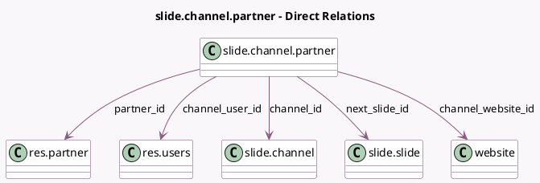

<!-- GENERATED:MODEL -->
---
tags: [odoo, community, generated, model]
---

# slide.channel.partner

- Module: [[docs/Community Addons/website_slides/website_slides|website_slides]]
- Scope: Community Addons
- Defined in module: yes
- Source files: `models/slide_channel_partner.py`
- Python classes: `SlideChannelPartner`
- Description: Channel / Partners (Members)

## Field footprint

- Detected fields: 15
- Field types: `Boolean` x 1, `Char` x 2, `Datetime` x 1, `Integer` x 2, `Many2one` x 5, `Selection` x 4
- Relation fields: 5

## Sample fields

- `active`: `Boolean`
- `channel_enroll`: `Selection` (related `channel_id.enroll`)
- `channel_id`: `Many2one` (comodel `slide.channel`)
- `channel_type`: `Selection` (related `channel_id.channel_type`)
- `channel_user_id`: `Many2one` (comodel `res.users`, related `channel_id.user_id`)
- `channel_visibility`: `Selection` (related `channel_id.visibility`)
- `channel_website_id`: `Many2one` (comodel `website`, related `channel_id.website_id`)
- `completed_slides_count`: `Integer` (comodel `# Completed Contents`)
- `completion`: `Integer` (comodel `% Completed Contents`)
- `invitation_link`: `Char` (comodel `Invitation Link`, compute `_compute_invitation_link`)
- `last_invitation_date`: `Datetime` (comodel `Last Invitation Date`)
- `member_status`: `Selection`
- `next_slide_id`: `Many2one` (comodel `slide.slide`, compute `_compute_next_slide_id`)
- `partner_email`: `Char` (related `partner_id.email`)
- `partner_id`: `Many2one` (comodel `res.partner`)

## Method hints

- Detected methods: 8
- Action methods: none
- Compute methods: `_compute_invitation_link`, `_compute_next_slide_id`
- Onchange methods: none

## Direct relation diagram

## Navigation

- **Parent:** [[docs/Community Addons/website_slides/Models]]

<!-- GENERATED:MODEL -->
