<!-- GENERATED:MODEL -->
---
tags: [odoo, community, generated, model]
---

# slide.channel.tag

- Module: [[docs/Community Addons/website_slides/website_slides|website_slides]]
- Scope: Community Addons
- Defined in module: yes
- Source files: `models/slide_channel_tag.py`
- Python classes: `SlideChannelTag`
- Description: Channel/Course Tag

## Field footprint

- Detected fields: 6
- Field types: `Char` x 1, `Integer` x 3, `Many2many` x 1, `Many2one` x 1
- Relation fields: 2

## Sample fields

- `channel_ids`: `Many2many` (comodel `slide.channel`)
- `color`: `Integer`
- `group_id`: `Many2one` (comodel `slide.channel.tag.group`)
- `group_sequence`: `Integer` (comodel `Group sequence`, related `group_id.sequence`, store `True`)
- `name`: `Char` (comodel `Name`)
- `sequence`: `Integer` (comodel `Sequence`)

## Method hints

- Detected methods: 0
- Action methods: none
- Compute methods: none
- Onchange methods: none

## Direct relation diagram

```plantuml
@startuml
!define ODOO_COLOR_PRIMARY #714B67
!define ODOO_COLOR_ACCENT #875A7B
!define ODOO_COLOR_BG #FAF7FA

skinparam backgroundColor ODOO_COLOR_BG
skinparam defaultTextAlignment left
skinparam ArrowColor ODOO_COLOR_ACCENT
skinparam ClassBackgroundColor white
skinparam ClassBorderColor ODOO_COLOR_PRIMARY
skinparam ComponentBackgroundColor white
skinparam ComponentBorderColor ODOO_COLOR_PRIMARY
skinparam NoteBackgroundColor #FFF8FF
skinparam NoteBorderColor ODOO_COLOR_ACCENT
skinparam SequenceLifeLineBorderColor ODOO_COLOR_ACCENT
skinparam SequenceLifeLineBackgroundColor #FFFFFF
skinparam SequenceParticipantBorderColor ODOO_COLOR_PRIMARY
skinparam SequenceParticipantBackgroundColor #FFFFFF
skinparam sequence {
  ArrowColor ODOO_COLOR_ACCENT
  ActorBorderColor ODOO_COLOR_PRIMARY
}
title slide.channel.tag - Direct Relations
class "slide.channel.tag" as slide_channel_tag
class "slide.channel" as slide_channel
class "slide.channel.tag.group" as slide_channel_tag_group
slide_channel_tag --> slide_channel_tag_group : group_id
slide_channel_tag .. slide_channel : channel_ids
@enduml
```

## Navigation

- **Parent:** [[docs/Community Addons/website_slides/Models]]

<!-- GENERATED:MODEL -->
