<!-- GENERATED:MODEL -->
---
tags: [odoo, community, generated, model]
---

# slide.embed

- Module: [[docs/Community Addons/website_slides/website_slides|website_slides]]
- Scope: Community Addons
- Defined in module: yes
- Source files: `models/slide_embed.py`
- Python classes: `SlideEmbed`
- Description: Embedded Slides View Counter

## Field footprint

- Detected fields: 4
- Field types: `Char` x 2, `Integer` x 1, `Many2one` x 1
- Relation fields: 1

## Sample fields

- `count_views`: `Integer` (comodel `# Views`)
- `slide_id`: `Many2one` (comodel `slide.slide`)
- `url`: `Char` (comodel `Third Party Website URL`)
- `website_name`: `Char` (comodel `Website`, compute `_compute_website_name`)

## Method hints

- Detected methods: 1
- Action methods: none
- Compute methods: `_compute_website_name`
- Onchange methods: none

## Direct relation diagram

```plantuml
@startuml
!define ODOO_COLOR_PRIMARY #714B67
!define ODOO_COLOR_ACCENT #875A7B
!define ODOO_COLOR_BG #FAF7FA

skinparam backgroundColor ODOO_COLOR_BG
skinparam defaultTextAlignment left
skinparam ArrowColor ODOO_COLOR_ACCENT
skinparam ClassBackgroundColor white
skinparam ClassBorderColor ODOO_COLOR_PRIMARY
skinparam ComponentBackgroundColor white
skinparam ComponentBorderColor ODOO_COLOR_PRIMARY
skinparam NoteBackgroundColor #FFF8FF
skinparam NoteBorderColor ODOO_COLOR_ACCENT
skinparam SequenceLifeLineBorderColor ODOO_COLOR_ACCENT
skinparam SequenceLifeLineBackgroundColor #FFFFFF
skinparam SequenceParticipantBorderColor ODOO_COLOR_PRIMARY
skinparam SequenceParticipantBackgroundColor #FFFFFF
skinparam sequence {
  ArrowColor ODOO_COLOR_ACCENT
  ActorBorderColor ODOO_COLOR_PRIMARY
}
title slide.embed - Direct Relations
class "slide.embed" as slide_embed
class "slide.slide" as slide_slide
slide_embed --> slide_slide : slide_id
@enduml
```

## Navigation

- **Parent:** [[docs/Community Addons/website_slides/Models]]

<!-- GENERATED:MODEL -->
