<!-- GENERATED:MODEL -->
---
tags: [odoo, community, generated, model]
---

# slide.question

- Module: [[docs/Community Addons/website_slides/website_slides|website_slides]]
- Scope: Community Addons
- Defined in module: yes
- Source files: `models/slide_question.py`
- Python classes: `SlideQuestion`
- Description: Content Quiz Question

## Field footprint

- Detected fields: 8
- Field types: `Char` x 2, `Float` x 1, `Integer` x 3, `Many2one` x 1, `One2many` x 1
- Relation fields: 2

## Sample fields

- `answer_ids`: `One2many` (comodel `slide.answer`)
- `answers_validation_error`: `Char` (comodel `Error on Answers`, compute `_compute_answers_validation_error`)
- `attempts_avg`: `Float` (compute `_compute_statistics`)
- `attempts_count`: `Integer` (compute `_compute_statistics`)
- `done_count`: `Integer` (compute `_compute_statistics`)
- `question`: `Char` (comodel `Question Name`)
- `sequence`: `Integer` (comodel `Sequence`)
- `slide_id`: `Many2one` (comodel `slide.slide`)

## Method hints

- Detected methods: 3
- Action methods: none
- Compute methods: `_compute_answers_validation_error`, `_compute_statistics`
- Onchange methods: none

## Direct relation diagram

```plantuml
@startuml
!define ODOO_COLOR_PRIMARY #714B67
!define ODOO_COLOR_ACCENT #875A7B
!define ODOO_COLOR_BG #FAF7FA

skinparam backgroundColor ODOO_COLOR_BG
skinparam defaultTextAlignment left
skinparam ArrowColor ODOO_COLOR_ACCENT
skinparam ClassBackgroundColor white
skinparam ClassBorderColor ODOO_COLOR_PRIMARY
skinparam ComponentBackgroundColor white
skinparam ComponentBorderColor ODOO_COLOR_PRIMARY
skinparam NoteBackgroundColor #FFF8FF
skinparam NoteBorderColor ODOO_COLOR_ACCENT
skinparam SequenceLifeLineBorderColor ODOO_COLOR_ACCENT
skinparam SequenceLifeLineBackgroundColor #FFFFFF
skinparam SequenceParticipantBorderColor ODOO_COLOR_PRIMARY
skinparam SequenceParticipantBackgroundColor #FFFFFF
skinparam sequence {
  ArrowColor ODOO_COLOR_ACCENT
  ActorBorderColor ODOO_COLOR_PRIMARY
}
title slide.question - Direct Relations
class "slide.question" as slide_question
class "slide.answer" as slide_answer
class "slide.slide" as slide_slide
slide_question --> slide_slide : slide_id
slide_question --|> slide_answer : answer_ids
@enduml
```

## Navigation

- **Parent:** [[docs/Community Addons/website_slides/Models]]

<!-- GENERATED:MODEL -->
