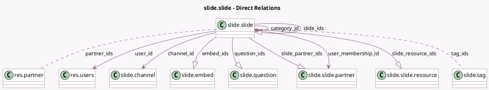

<!-- GENERATED:MODEL -->
---
tags: [odoo, community, generated, model]
---

# slide.slide

- Module: [[docs/Community Addons/website_slides/website_slides|website_slides]]
- Scope: Community Addons
- Defined in module: yes
- Source files: `models/slide_slide.py`
- Python classes: `SlideSlide`
- Description: Slides
- Inherits: `image.mixin`, `mail.thread`, `website.published.mixin`, `website.searchable.mixin`, `website.seo.metadata`

## Field footprint

- Detected fields: 69
- Field types: `Binary` x 3, `Boolean` x 12, `Char` x 10, `Datetime` x 1, `Float` x 1, `Html` x 4, `Image` x 1, `Integer` x 20, `Many2many` x 2, `Many2one` x 5, `One2many` x 5, `Selection` x 5
- Relation fields: 12

## Sample fields

- `active`: `Boolean`
- `binary_content`: `Binary` (comodel `File`)
- `can_self_mark_completed`: `Boolean` (comodel `Can Mark Completed`, compute `_compute_mark_complete_actions`)
- `can_self_mark_uncompleted`: `Boolean` (comodel `Can Mark Uncompleted`, compute `_compute_mark_complete_actions`)
- `category_id`: `Many2one` (comodel `slide.slide`, compute `_compute_category_id`, store `True`)
- `channel_allow_comment`: `Boolean` (related `channel_id.allow_comment`)
- `channel_id`: `Many2one` (comodel `slide.channel`)
- `channel_type`: `Selection` (related `channel_id.channel_type`)
- `comments_count`: `Integer` (comodel `Number of comments`, compute `_compute_comments_count`)
- `completion_time`: `Float` (comodel `Duration`, compute `_compute_category_completion_time`, store `True`)
- `date_published`: `Datetime` (comodel `Publish Date`)
- `description`: `Html` (comodel `Description`)
- `dislikes`: `Integer` (comodel `Dislikes`, compute `_compute_like_info`, store `True`)
- `document_binary_content`: `Binary` (comodel `PDF Content`, related `binary_content`)
- `document_google_url`: `Char` (comodel `Document Link`, related `url`)
- `embed_code`: `Html` (comodel `Embed Code`, compute `_compute_embed_code`)
- `embed_code_external`: `Html` (comodel `External Embed Code`, compute `_compute_embed_code`)
- `embed_count`: `Integer` (comodel `# of Embeds`, compute `_compute_embed_counts`)
- `embed_ids`: `One2many` (comodel `slide.embed`)
- `google_drive_id`: `Char` (comodel `Google Drive ID of the external URL`, compute `_compute_google_drive_id`)

## Method hints

- Detected methods: 64
- Action methods: `action_dislike`, `action_like`, `action_mark_completed`, `action_mark_uncompleted`, `action_set_viewed`, `action_view_embeds`
- Compute methods: `_compute_can_publish`, `_compute_category_completed`, `_compute_category_completion_time`, `_compute_category_id`, `_compute_comments_count`, `_compute_embed_code`, `_compute_embed_counts`, `_compute_google_drive_id`, and 18 more
- Onchange methods: `_on_change_document_binary_content`, `_on_change_slide_category`, `_on_change_url`

## Direct relation diagram

## Navigation

- **Parent:** [[docs/Community Addons/website_slides/Models]]

<!-- GENERATED:MODEL -->
