<!-- GENERATED:MODEL -->
---
tags: [odoo, community, generated, model]
---

# slide.slide.partner

- Module: [[docs/Community Addons/website_slides/website_slides|website_slides]]
- Scope: Community Addons
- Defined in module: yes
- Source files: `models/slide_slide_partner.py`
- Python classes: `SlideSlidePartner`
- Description: Slide / Partner decorated m2m

## Field footprint

- Detected fields: 7
- Field types: `Boolean` x 1, `Integer` x 2, `Many2one` x 3, `Selection` x 1
- Relation fields: 3

## Sample fields

- `channel_id`: `Many2one` (comodel `slide.channel`, related `slide_id.channel_id`, store `True`)
- `completed`: `Boolean` (comodel `Completed`)
- `partner_id`: `Many2one` (comodel `res.partner`)
- `quiz_attempts_count`: `Integer` (comodel `Quiz attempts count`)
- `slide_category`: `Selection` (related `slide_id.slide_category`)
- `slide_id`: `Many2one` (comodel `slide.slide`)
- `vote`: `Integer` (comodel `Vote`)

## Method hints

- Detected methods: 3
- Action methods: none
- Compute methods: none
- Onchange methods: none

## Direct relation diagram

```plantuml
@startuml
!define ODOO_COLOR_PRIMARY #714B67
!define ODOO_COLOR_ACCENT #875A7B
!define ODOO_COLOR_BG #FAF7FA

skinparam backgroundColor ODOO_COLOR_BG
skinparam defaultTextAlignment left
skinparam ArrowColor ODOO_COLOR_ACCENT
skinparam ClassBackgroundColor white
skinparam ClassBorderColor ODOO_COLOR_PRIMARY
skinparam ComponentBackgroundColor white
skinparam ComponentBorderColor ODOO_COLOR_PRIMARY
skinparam NoteBackgroundColor #FFF8FF
skinparam NoteBorderColor ODOO_COLOR_ACCENT
skinparam SequenceLifeLineBorderColor ODOO_COLOR_ACCENT
skinparam SequenceLifeLineBackgroundColor #FFFFFF
skinparam SequenceParticipantBorderColor ODOO_COLOR_PRIMARY
skinparam SequenceParticipantBackgroundColor #FFFFFF
skinparam sequence {
  ArrowColor ODOO_COLOR_ACCENT
  ActorBorderColor ODOO_COLOR_PRIMARY
}
title slide.slide.partner - Direct Relations
class "slide.slide.partner" as slide_slide_partner
class "res.partner" as res_partner
class "slide.channel" as slide_channel
class "slide.slide" as slide_slide
slide_slide_partner --> slide_slide : slide_id
slide_slide_partner --> slide_channel : channel_id
slide_slide_partner --> res_partner : partner_id
@enduml
```

## Navigation

- **Parent:** [[docs/Community Addons/website_slides/Models]]

<!-- GENERATED:MODEL -->
