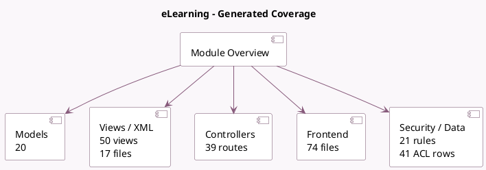

<!-- GENERATED:MODULE -->
---
tags: [odoo, community, module]
---

# eLearning

- Scope: Community Addons
- Source: odoo/addons/website_slides
- Dependencies: [[docs/Community Addons/portal_rating/portal_rating|portal_rating]], [[docs/Community Addons/website/website|website]], [[docs/Community Addons/website_mail/website_mail|website_mail]], [[docs/Community Addons/website_profile/website_profile|website_profile]]

## Summary

Manage and publish an eLearning platform

## Generated coverage

- Models: 20
- XML files with UI/data artifacts: 17
- Views: 50
- Actions: 29
- Menus: 15
- Rules (ir.rule): 21
- Access CSV entries: 41
- Controller units: 2
- Frontend asset files: 74

## Module map

## Detail notes

- Models: [[docs/Community Addons/website_slides/Models|Models]] (20)
- Views and XML: [[docs/Community Addons/website_slides/Views|Views]] (17 files)
- Controllers: [[docs/Community Addons/website_slides/Controllers|Controllers]] (2)
- Frontend: [[docs/Community Addons/website_slides/Frontend|Frontend]] (74 files)

## Key models

- `gamification.challenge`
- `gamification.karma.tracking`
- `mail.activity`
- `res.config.settings`
- `res.groups`
- `res.partner`
- `res.users`
- `slide.answer`
- `slide.channel`
- `slide.channel.invite`
- `slide.channel.partner`
- `slide.channel.tag`

## Navigation

- [[../Community Addons/Community Addons|Back to scope]]
- [[../../docs/docs|Back to docs]]

<!-- GENERATED:MODULE -->

