<!-- GENERATED:MODEL -->
---
tags: [odoo, community, generated, model]
---

# forum.forum

- Module: [[docs/Community Addons/website_slides_forum/website_slides_forum|website_slides_forum]]
- Scope: Community Addons
- Defined in module: extension only
- Source files: `models/forum_forum.py`
- Python classes: `ForumForum`

## Field footprint

- Detected fields: 4
- Field types: `Image` x 1, `Many2one` x 1, `One2many` x 1, `Selection` x 1
- Relation fields: 2

## Sample fields

- `image_1920`: `Image` (comodel `Image`, compute `_compute_image_1920`, store `True`)
- `slide_channel_id`: `Many2one` (comodel `slide.channel`, compute `_compute_slide_channel_id`, store `True`)
- `slide_channel_ids`: `One2many` (comodel `slide.channel`)
- `visibility`: `Selection` (related `slide_channel_id.visibility`)

## Method hints

- Detected methods: 2
- Action methods: none
- Compute methods: `_compute_image_1920`, `_compute_slide_channel_id`
- Onchange methods: none

## Direct relation diagram

```plantuml
@startuml
!define ODOO_COLOR_PRIMARY #714B67
!define ODOO_COLOR_ACCENT #875A7B
!define ODOO_COLOR_BG #FAF7FA

skinparam backgroundColor ODOO_COLOR_BG
skinparam defaultTextAlignment left
skinparam ArrowColor ODOO_COLOR_ACCENT
skinparam ClassBackgroundColor white
skinparam ClassBorderColor ODOO_COLOR_PRIMARY
skinparam ComponentBackgroundColor white
skinparam ComponentBorderColor ODOO_COLOR_PRIMARY
skinparam NoteBackgroundColor #FFF8FF
skinparam NoteBorderColor ODOO_COLOR_ACCENT
skinparam SequenceLifeLineBorderColor ODOO_COLOR_ACCENT
skinparam SequenceLifeLineBackgroundColor #FFFFFF
skinparam SequenceParticipantBorderColor ODOO_COLOR_PRIMARY
skinparam SequenceParticipantBackgroundColor #FFFFFF
skinparam sequence {
  ArrowColor ODOO_COLOR_ACCENT
  ActorBorderColor ODOO_COLOR_PRIMARY
}
title forum.forum - Direct Relations
class "forum.forum" as forum_forum
class "slide.channel" as slide_channel
forum_forum --|> slide_channel : slide_channel_ids
forum_forum --> slide_channel : slide_channel_id
@enduml
```

## Navigation

- **Parent:** [[docs/Community Addons/website_slides_forum/Models]]

<!-- GENERATED:MODEL -->
