<!-- GENERATED:MODEL -->
---
tags: [odoo, community, generated, model]
---

# slide.channel

- Module: [[docs/Community Addons/website_slides_forum/website_slides_forum|website_slides_forum]]
- Scope: Community Addons
- Defined in module: extension only
- Source files: `models/slide_channel.py`
- Python classes: `SlideChannel`

## Field footprint

- Detected fields: 2
- Field types: `Integer` x 1, `Many2one` x 1
- Relation fields: 1

## Sample fields

- `forum_id`: `Many2one` (comodel `forum.forum`)
- `forum_total_posts`: `Integer` (comodel `Number of active forum posts`, related `forum_id.total_posts`)

## Method hints

- Detected methods: 3
- Action methods: `action_redirect_to_forum`
- Compute methods: none
- Onchange methods: none

## Direct relation diagram

```plantuml
@startuml
!define ODOO_COLOR_PRIMARY #714B67
!define ODOO_COLOR_ACCENT #875A7B
!define ODOO_COLOR_BG #FAF7FA

skinparam backgroundColor ODOO_COLOR_BG
skinparam defaultTextAlignment left
skinparam ArrowColor ODOO_COLOR_ACCENT
skinparam ClassBackgroundColor white
skinparam ClassBorderColor ODOO_COLOR_PRIMARY
skinparam ComponentBackgroundColor white
skinparam ComponentBorderColor ODOO_COLOR_PRIMARY
skinparam NoteBackgroundColor #FFF8FF
skinparam NoteBorderColor ODOO_COLOR_ACCENT
skinparam SequenceLifeLineBorderColor ODOO_COLOR_ACCENT
skinparam SequenceLifeLineBackgroundColor #FFFFFF
skinparam SequenceParticipantBorderColor ODOO_COLOR_PRIMARY
skinparam SequenceParticipantBackgroundColor #FFFFFF
skinparam sequence {
  ArrowColor ODOO_COLOR_ACCENT
  ActorBorderColor ODOO_COLOR_PRIMARY
}
title slide.channel - Direct Relations
class "slide.channel" as slide_channel
class "forum.forum" as forum_forum
slide_channel --> forum_forum : forum_id
@enduml
```

## Navigation

- **Parent:** [[docs/Community Addons/website_slides_forum/Models]]

<!-- GENERATED:MODEL -->
