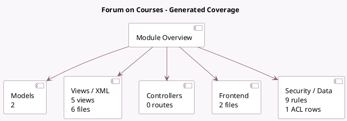

<!-- GENERATED:MODULE -->
---
tags: [odoo, community, module]
---

# Forum on Courses

- Scope: Community Addons
- Source: odoo/addons/website_slides_forum
- Dependencies: [[docs/Community Addons/website_slides/website_slides|website_slides]], [[docs/Community Addons/website_forum/website_forum|website_forum]]

## Summary

Allows to link forum on a course

## Generated coverage

- Models: 2
- XML files with UI/data artifacts: 6
- Views: 5
- Actions: 2
- Menus: 3
- Rules (ir.rule): 9
- Access CSV entries: 1
- Controller units: 0
- Frontend asset files: 2

## Module map

## Detail notes

- Models: [[docs/Community Addons/website_slides_forum/Models|Models]] (2)
- Views and XML: [[docs/Community Addons/website_slides_forum/Views|Views]] (6 files)
- Frontend: [[docs/Community Addons/website_slides_forum/Frontend|Frontend]] (2 files)

## Key models

- `forum.forum`
- `slide.channel`

## Navigation

- [[../Community Addons/Community Addons|Back to scope]]
- [[../../docs/docs|Back to docs]]

<!-- GENERATED:MODULE -->

