<!-- GENERATED:MODEL -->
---
tags: [odoo, community, generated, model]
---

# slide.slide

- Module: [[docs/Community Addons/website_slides_survey/website_slides_survey|website_slides_survey]]
- Scope: Community Addons
- Defined in module: extension only
- Source files: `models/slide_slide.py`
- Python classes: `SlideSlide`

## Field footprint

- Detected fields: 6
- Field types: `Boolean` x 1, `Char` x 1, `Integer` x 1, `Many2one` x 1, `Selection` x 2
- Relation fields: 1

## Sample fields

- `is_preview`: `Boolean` (compute `_compute_is_preview`, store `True`)
- `name`: `Char` (compute `_compute_name`, store `True`)
- `nbr_certification`: `Integer` (comodel `Number of Certifications`, compute `_compute_slides_statistics`, store `True`)
- `slide_category`: `Selection`
- `slide_type`: `Selection`
- `survey_id`: `Many2one` (comodel `survey.survey`)

## Method hints

- Detected methods: 10
- Action methods: none
- Compute methods: `_compute_is_preview`, `_compute_mark_complete_actions`, `_compute_name`, `_compute_slide_icon_class`, `_compute_slide_type`
- Onchange methods: none

## Direct relation diagram

```plantuml
@startuml
!define ODOO_COLOR_PRIMARY #714B67
!define ODOO_COLOR_ACCENT #875A7B
!define ODOO_COLOR_BG #FAF7FA

skinparam backgroundColor ODOO_COLOR_BG
skinparam defaultTextAlignment left
skinparam ArrowColor ODOO_COLOR_ACCENT
skinparam ClassBackgroundColor white
skinparam ClassBorderColor ODOO_COLOR_PRIMARY
skinparam ComponentBackgroundColor white
skinparam ComponentBorderColor ODOO_COLOR_PRIMARY
skinparam NoteBackgroundColor #FFF8FF
skinparam NoteBorderColor ODOO_COLOR_ACCENT
skinparam SequenceLifeLineBorderColor ODOO_COLOR_ACCENT
skinparam SequenceLifeLineBackgroundColor #FFFFFF
skinparam SequenceParticipantBorderColor ODOO_COLOR_PRIMARY
skinparam SequenceParticipantBackgroundColor #FFFFFF
skinparam sequence {
  ArrowColor ODOO_COLOR_ACCENT
  ActorBorderColor ODOO_COLOR_PRIMARY
}
title slide.slide - Direct Relations
class "slide.slide" as slide_slide
class "survey.survey" as survey_survey
slide_slide --> survey_survey : survey_id
@enduml
```

## Navigation

- **Parent:** [[docs/Community Addons/website_slides_survey/Models]]

<!-- GENERATED:MODEL -->
