<!-- GENERATED:MODEL -->
---
tags: [odoo, community, generated, model]
---

# slide.slide.partner

- Module: [[docs/Community Addons/website_slides_survey/website_slides_survey|website_slides_survey]]
- Scope: Community Addons
- Defined in module: extension only
- Source files: `models/slide_slide.py`
- Python classes: `SlideSlidePartner`

## Field footprint

- Detected fields: 2
- Field types: `Boolean` x 1, `One2many` x 1
- Relation fields: 1

## Sample fields

- `survey_scoring_success`: `Boolean` (comodel `Certification Succeeded`, compute `_compute_survey_scoring_success`, store `True`)
- `user_input_ids`: `One2many` (comodel `survey.user_input`)

## Method hints

- Detected methods: 3
- Action methods: none
- Compute methods: `_compute_field_value`, `_compute_survey_scoring_success`
- Onchange methods: none

## Direct relation diagram

```plantuml
@startuml
!define ODOO_COLOR_PRIMARY #714B67
!define ODOO_COLOR_ACCENT #875A7B
!define ODOO_COLOR_BG #FAF7FA

skinparam backgroundColor ODOO_COLOR_BG
skinparam defaultTextAlignment left
skinparam ArrowColor ODOO_COLOR_ACCENT
skinparam ClassBackgroundColor white
skinparam ClassBorderColor ODOO_COLOR_PRIMARY
skinparam ComponentBackgroundColor white
skinparam ComponentBorderColor ODOO_COLOR_PRIMARY
skinparam NoteBackgroundColor #FFF8FF
skinparam NoteBorderColor ODOO_COLOR_ACCENT
skinparam SequenceLifeLineBorderColor ODOO_COLOR_ACCENT
skinparam SequenceLifeLineBackgroundColor #FFFFFF
skinparam SequenceParticipantBorderColor ODOO_COLOR_PRIMARY
skinparam SequenceParticipantBackgroundColor #FFFFFF
skinparam sequence {
  ArrowColor ODOO_COLOR_ACCENT
  ActorBorderColor ODOO_COLOR_PRIMARY
}
title slide.slide.partner - Direct Relations
class "slide.slide.partner" as slide_slide_partner
class "survey.user_input" as survey_user_input
slide_slide_partner --|> survey_user_input : user_input_ids
@enduml
```

## Navigation

- **Parent:** [[docs/Community Addons/website_slides_survey/Models]]

<!-- GENERATED:MODEL -->
