<!-- GENERATED:MODEL -->
---
tags: [odoo, community, generated, model]
---

# survey.survey

- Module: [[docs/Community Addons/website_slides_survey/website_slides_survey|website_slides_survey]]
- Scope: Community Addons
- Defined in module: extension only
- Source files: `models/survey_survey.py`
- Python classes: `SurveySurvey`

## Field footprint

- Detected fields: 3
- Field types: `Integer` x 1, `One2many` x 2
- Relation fields: 2

## Sample fields

- `slide_channel_count`: `Integer` (comodel `Courses Count`, compute `_compute_slide_channel_data`)
- `slide_channel_ids`: `One2many` (comodel `slide.channel`, compute `_compute_slide_channel_data`)
- `slide_ids`: `One2many` (comodel `slide.slide`)

## Method hints

- Detected methods: 4
- Action methods: `action_survey_view_slide_channels`
- Compute methods: `_compute_slide_channel_data`
- Onchange methods: none

## Direct relation diagram

```plantuml
@startuml
!define ODOO_COLOR_PRIMARY #714B67
!define ODOO_COLOR_ACCENT #875A7B
!define ODOO_COLOR_BG #FAF7FA

skinparam backgroundColor ODOO_COLOR_BG
skinparam defaultTextAlignment left
skinparam ArrowColor ODOO_COLOR_ACCENT
skinparam ClassBackgroundColor white
skinparam ClassBorderColor ODOO_COLOR_PRIMARY
skinparam ComponentBackgroundColor white
skinparam ComponentBorderColor ODOO_COLOR_PRIMARY
skinparam NoteBackgroundColor #FFF8FF
skinparam NoteBorderColor ODOO_COLOR_ACCENT
skinparam SequenceLifeLineBorderColor ODOO_COLOR_ACCENT
skinparam SequenceLifeLineBackgroundColor #FFFFFF
skinparam SequenceParticipantBorderColor ODOO_COLOR_PRIMARY
skinparam SequenceParticipantBackgroundColor #FFFFFF
skinparam sequence {
  ArrowColor ODOO_COLOR_ACCENT
  ActorBorderColor ODOO_COLOR_PRIMARY
}
title survey.survey - Direct Relations
class "survey.survey" as survey_survey
class "slide.channel" as slide_channel
class "slide.slide" as slide_slide
survey_survey --|> slide_slide : slide_ids
survey_survey --|> slide_channel : slide_channel_ids
@enduml
```

## Navigation

- **Parent:** [[docs/Community Addons/website_slides_survey/Models]]

<!-- GENERATED:MODEL -->
