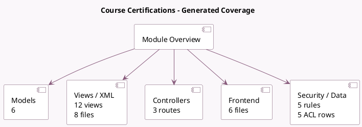

<!-- GENERATED:MODULE -->
---
tags: [odoo, community, module]
---

# Course Certifications

- Scope: Community Addons
- Source: odoo/addons/website_slides_survey
- Dependencies: [[docs/Community Addons/website_slides/website_slides|website_slides]], [[docs/Community Addons/survey/survey|survey]]

## Summary

Add certification capabilities to your courses

## Generated coverage

- Models: 6
- XML files with UI/data artifacts: 8
- Views: 12
- Actions: 5
- Menus: 1
- Rules (ir.rule): 5
- Access CSV entries: 5
- Controller units: 1
- Frontend asset files: 6

## Module map

## Detail notes

- Models: [[docs/Community Addons/website_slides_survey/Models|Models]] (6)
- Views and XML: [[docs/Community Addons/website_slides_survey/Views|Views]] (8 files)
- Controllers: [[docs/Community Addons/website_slides_survey/Controllers|Controllers]] (1)
- Frontend: [[docs/Community Addons/website_slides_survey/Frontend|Frontend]] (6 files)

## Key models

- `slide.channel`
- `slide.channel.partner`
- `slide.slide`
- `slide.slide.partner`
- `survey.survey`
- `survey.user_input`

## Navigation

- [[../Community Addons/Community Addons|Back to scope]]
- [[../../docs/docs|Back to docs]]

<!-- GENERATED:MODULE -->

