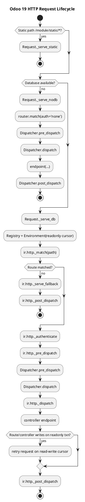
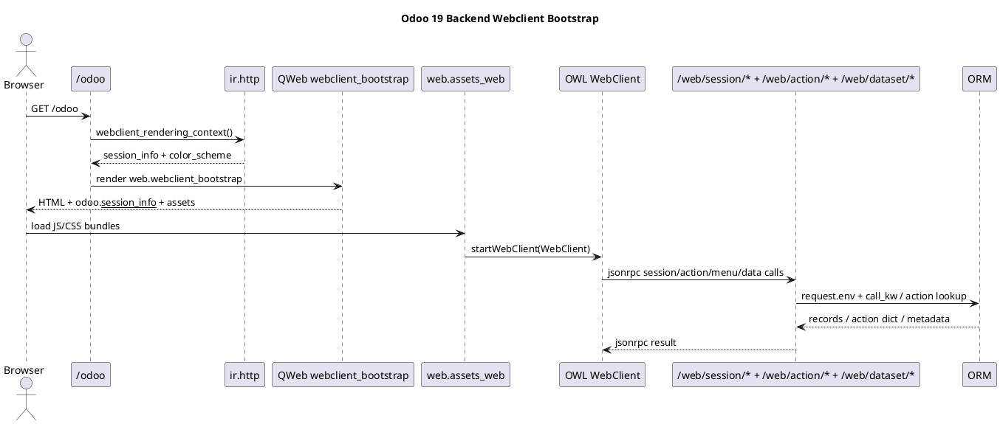
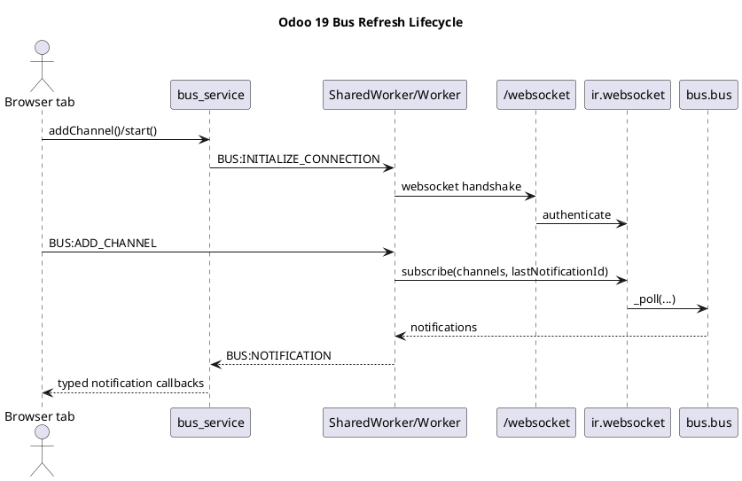

# Runtime Lifecycle

## Scope
- End-to-end runtime path from HTTP ingress to controller execution and ORM access.
- Web client bootstrap, asset loading, session payload hydration, and route-driven RPC.
- Bus/websocket refresh flow used by the live backend UI.

## Source areas
- `odoo19/odoo/http.py`
- `odoo19/odoo/addons/base/models/ir_http.py`
- `odoo19/addons/web/controllers/home.py`
- `odoo19/addons/web/controllers/session.py`
- `odoo19/addons/web/controllers/dataset.py`
- `odoo19/addons/web/static/src/start.js`
- `odoo19/addons/web/static/src/webclient/webclient.js`
- `odoo19/addons/bus/controllers/websocket.py`
- `odoo19/addons/bus/static/src/services/bus_service.js`

## Request lifecycle in Odoo 19
- `Application.__call__` in `odoo/http.py` is the real ingress. It chooses between static delivery, `_serve_nodb`, and `_serve_db`.
- `_serve_nodb` only supports database-free routes, typically `auth="none"` endpoints such as health checks or pre-database flows.
- `_serve_db` opens the registry, creates the initial environment, resolves the matching route through `ir.http._match(...)`, and then decides whether the request can stay on a read-only cursor.
- A matched DB-backed route goes through `_authenticate`, `_pre_dispatch`, dispatcher-specific request decoding, `ir.http._dispatch(...)`, and `_post_dispatch`.
- A route marked `readonly=True` can stay on the read-only cursor until code actually tries to write. If that happens, Odoo retries the same logical request on a read-write cursor.

## Dispatch and ORM boundary
- `HttpDispatcher` populates `request.params` from query string and form data, enforces CSRF for unsafe HTTP methods by default, and then delegates to `ir.http._dispatch(...)`.
- `JsonRPCDispatcher` parses JSON payloads, uses named `params`, and also delegates to `ir.http._dispatch(...)`.
- Core web client endpoints such as `/web/session/get_session_info`, `/web/action/load`, and `/web/dataset/call_kw` are `type='jsonrpc'`.
- `/web/dataset/call_kw` is where much of the backend UI crosses from controller dispatch into model execution. The controller delegates to `odoo.service.model.call_kw(...)` with `request.env[model]`.

## Web client bootstrap
- `/web`, `/odoo`, and `/odoo/<subpath>` are handled by `web.controllers.home.Home.web_client`.
- That controller ensures a database exists, checks for a live session, restores the user because the route itself is declared with `auth="none"`, and then builds the rendering context through `ir.http.webclient_rendering_context()`.
- `web.webclient_bootstrap` injects `odoo.__session_info__`, computes the menu loading URL, and pulls in `web.assets_web`.
- `web.assets_web` includes `web.assets_backend` plus `web/static/src/main.js` and `web/static/src/start.js`, which mount the OWL `WebClient`.
- Once mounted, the client restores router state, loads actions, and falls back to the first app menu when the URL does not encode a current action.

## Session and auth boundaries
- `auth="none"` means the route can run before normal authenticated ORM usage; it does not mean "public user with full environment". Code should not assume model access is safe before `_authenticate`.
- `auth="public"` resolves to the public user when there is no logged-in session.
- `auth="user"` requires a valid non-public session and raises `SessionExpiredException` otherwise.
- `auth="bearer"` is API-key oriented. It can run statelessly by validating the bearer token and disabling session persistence with `request.session.can_save = False`.
- `web_client` is a special case: it uses `auth="none"` for bootstrap compatibility in multi-db mode, then explicitly restores the session user with `request.update_env(user=request.session.uid)` before rendering the backend shell.

## Readonly semantics
- Route `readonly` is a real runtime knob, not a documentation hint.
- Many session, action, and dataset endpoints are readonly because they mainly fetch state.
- `DataSet.call_kw` computes readonly dynamically by looking for a `_readonly` marker on the target model method. That allows the RPC layer to keep some model calls on the read-only cursor path.
- A controller that accidentally writes during a readonly request is retried on a read-write cursor, so readonly is a performance and isolation hint, not a hard functional guarantee.

## Bus-driven refresh flow
- The backend UI does not rely on each tab opening its own independent live connection. `bus_service` prefers a `SharedWorker` and falls back to `Worker`, so multiple tabs can share one websocket pipeline.
- `session_info()` and `get_frontend_session_info()` are extended by the `bus` addon to expose `websocket_worker_version`, which the frontend uses to fetch the correct worker bundle and websocket version.
- The worker initializes the websocket URL, opens `/websocket?version=...`, and keeps track of channels plus the last notification id.
- `ir.websocket` authenticates the websocket request, augments the subscription channel list with broadcast, group, and partner channels, and then `bus.bus._poll(...)` delivers notifications.
- The controller `/websocket/peek_notifications` exists as a compatibility and session-expiry probe path around the main websocket flow.

## Practical implications
- A backend page load is never just "render HTML". It bootstraps a client runtime that immediately begins route, menu, session, and action hydration.
- Controller code that executes before `_authenticate` or under `auth="none"` should be treated as bootstrap-sensitive and kept narrow.
- When tracing a UI bug, separate three layers: page shell bootstrap, JSON-RPC controller contract, and ORM/service behavior.
- When tracing a stale UI problem, inspect the bus worker and websocket lifecycle before blaming RPC caching.

## Related notes
- `[[docs/Core/Framework/http]]`
- `[[docs/Core/Framework/web]]`
- `[[docs/Core/Framework/auth]]`
- `[[docs/Core/Infrastructure/Bus]]`

## Navigation
- **Parent:** [[docs/Core/Framework/Framework]]
