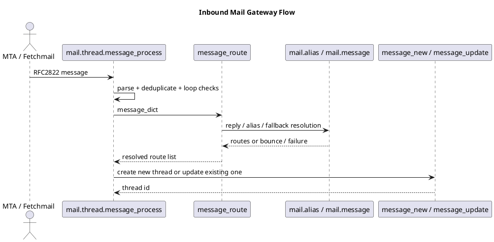

# Mail Gateway

## Scope
- How inbound email reaches business records through `mail.thread`.
- The routing heuristics behind aliases, replies, fallback models, and bounce handling.
- The difference between fetchmail ingestion and MTA pipe ingestion.

## Source areas
- `odoo19/addons/mail/models/mail_thread.py`
- `odoo19/addons/mail/models/fetchmail.py`
- `odoo19/addons/mail/static/scripts/odoo-mailgate.py`

## Entry points
- `mail.thread.message_process(...)` is the canonical inbound entry point.
- It accepts an RFC2822 message as `str` or `xmlrpclib.Binary`, parses it, deduplicates by `Message-Id`, detects mail loops, resolves routes, and finally calls either `message_new(...)` or `message_update(...)`.
- `fetchmail.server` uses the same contract. The cron fetches unread messages and calls `MailThread.message_process(model=server.object_id.model, save_original=server.original, strip_attachments=not server.attach)`.
- `odoo-mailgate.py` is the MTA-facing pipe script. It reads the raw message from stdin and forwards it over XML-RPC to `mail.thread.message_process(False, xmlrpclib.Binary(msg), {})`.

## Routing contract
- `message_route(...)` tries to resolve the destination in a clear order:
  1. Reply to an existing thread through `References` or `In-Reply-To`.
  2. Match one or more `mail.alias` records on the recipients.
  3. Fall back to the explicitly provided `model`, `thread_id`, and `custom_values`.
  4. Raise `ValueError` when no valid route exists.
- Bounce emails are handled before normal routing. When the parsed message is identified as a bounce, `_routing_handle_bounce(...)` updates notification state and the message is not routed as business input.
- Direct writes to catchall addresses can trigger an automatic bounce instead of a record creation.

## Model-side extension points
- `message_new(msg_dict, custom_values=None)` is the hook for models that create a new business record from a new inbound conversation.
- `message_update(msg_dict, update_vals=None)` is the hook for models that attach or react to inbound follow-up mail on an existing record.
- A model that expects inbound email should implement or inherit the right behavior there instead of reimplementing the gateway logic in controllers.
- `_message_receive_bounce(...)` and `_message_reset_bounce(...)` are the model-side hooks for bounce-related behavior.

## Failure handling
- Duplicate `Message-Id` values are ignored instead of being processed twice.
- Bounce replies and loop-detection replies are discarded early.
- If no route is possible, `message_route(...)` raises `ValueError`. The MTA script maps that case to `EX_NOUSER`, which is what lets Postfix or Exim treat it as an alias problem instead of a transport crash.
- `fetchmail.server` isolates message processing in a separate transaction. A failure rolls back only that message, increments the failure count, and can eventually deactivate the server after repeated general failures.

## Practical rules
- If a business model should accept email, document its `message_new(...)` and `message_update(...)` behavior instead of describing inbound routing as magic.
- When diagnosing mail ingestion, separate three layers: transport acquisition (`fetchmail` or MTA pipe), route resolution (`message_route`), and model-specific record handling.
- Do not document alias-based record creation without also documenting what happens on unroutable messages and bounce scenarios.

## Related notes
- `[[docs/Core/Framework/mail]]`
- `[[docs/Core/Infrastructure/Bus]]`

## Navigation
- **Parent:** [[docs/Core/Integrations/Integrations]]
