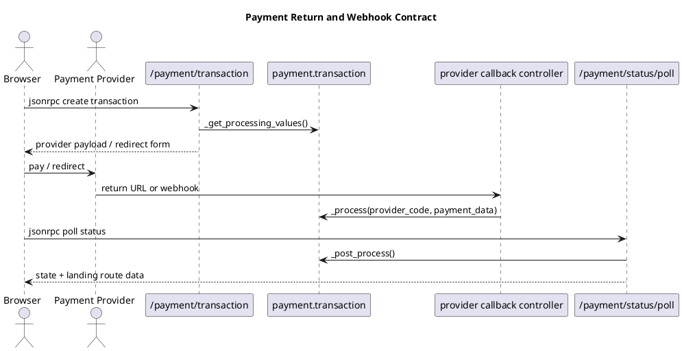

# Payment Provider Callbacks

## Scope
- Public payment routes, return URLs, webhooks, and post-processing handoff.
- The shared transaction contract that provider-specific addons plug into.
- Authentication, CSRF, and failure behavior on payment-facing endpoints.

## Source areas
- `odoo19/addons/payment/controllers/portal.py`
- `odoo19/addons/payment/controllers/post_processing.py`
- `odoo19/addons/payment/models/payment_transaction.py`
- `odoo19/addons/payment/models/payment_provider.py`
- `odoo19/addons/payment_*/controllers/*.py`

## Shared flow
- `/payment/transaction` is the generic public JSON-RPC route that creates a draft transaction and returns `tx._get_processing_values()`.
- That route checks the partner-scoped access token first and rejects mismatches before creating anything.
- `_validate_transaction_kwargs(...)` enforces a whitelist so browser-injected kwargs cannot silently end up in transaction create values.
- `_get_processing_values()` returns the generic payload that the frontend or redirect form needs: provider id/code, reference, amount, currency, partner, tokenization intent, state, and optional provider-specific extras.

## Callback contract
- Provider addons usually expose two public surfaces:
  - a return route used when the browser comes back from the provider;
  - a webhook or notification route used by the provider server.
- Across the payment addons shipped in the source tree, webhook routes are consistently `auth='public'` and typically `csrf=False` because the caller is external.
- Several return routes also disable session persistence with `save_session=False`, which is the right fit when the provider calls back without needing a browser session mutation.
- Provider controllers normally normalize the provider payload and then call `request.env['payment.transaction'].sudo()._process(provider_code, payment_data)`.

## Transaction-side contract
- `payment.transaction._process(provider_code, payment_data)` is the normalization point shared by provider controllers.
- `_process(...)` resolves the transaction through `_search_by_reference(...)`, validates amount and currency when the provider exposes them, applies provider-specific updates, and tokenizes when the final state allows it.
- `_extract_reference(...)` is the provider hook for locating the transaction from callback data.
- `_apply_updates(...)` is the provider hook for setting state, provider reference, payment method, and other provider-specific fields.
- `_post_process(...)` is a later phase. It is triggered from `/payment/status/poll` or the background cron and is where Odoo finalizes the transaction's downstream side effects.

## Proxy and RPC-style provider calls
- `payment.provider._prepare_json_rpc_payload(...)` builds a standard JSON-RPC 2.0 envelope for proxy requests to providers or proxy services.
- `payment.provider._parse_proxy_response(...)` expects a JSON-RPC response that may still come back with HTTP 200 even when the provider-side call failed.
- That means payment integrations must inspect the JSON-RPC body, not only the HTTP status code, when going through the proxy helpers.

## Failure handling
- An invalid browser access token on `/payment/transaction` raises `Forbidden`.
- Rejected or unexpected kwargs on that route raise `BadRequest`.
- `_search_by_reference(...)` logs missing references or missing transactions instead of guessing.
- `/payment/status/poll` rolls back and raises a retry signal when the transaction cannot commit because of transient database errors, and logs other post-processing exceptions before surfacing them.

## Practical rules
- Keep provider controllers thin. Signature verification, payload normalization, and transaction lookup belong there; business state mutation belongs in `_process(...)` and provider overrides.
- External callbacks should not rely on browser session state.
- Document every provider callback in terms of four steps: payload verification, reference extraction, `_process(...)`, and post-processing handoff.

## Related notes
- `[[docs/Core/Integrations/HTTP and RPC Contracts]]`
- `[[docs/Core/Framework/http]]`

## Navigation
- **Parent:** [[docs/Core/Integrations/Integrations]]
