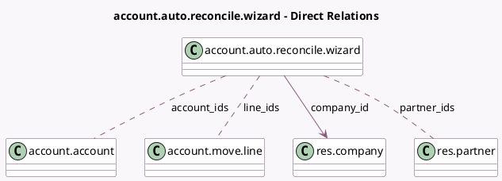

<!-- GENERATED:MODEL -->
---
tags: [odoo, enterprise, generated, model]
---

# account.auto.reconcile.wizard

- Module: [[docs/Enterprise Addons/account_accountant/account_accountant|account_accountant]]
- Scope: Enterprise Addons
- Defined in module: yes
- Source files: `wizard/account_auto_reconcile_wizard.py`
- Python classes: `AccountAutoReconcileWizard`
- Description: Account automatic reconciliation wizard

## Field footprint

- Detected fields: 7
- Field types: `Date` x 2, `Many2many` x 3, `Many2one` x 1, `Selection` x 1
- Relation fields: 4

## Sample fields

- `account_ids`: `Many2many` (comodel `account.account`)
- `company_id`: `Many2one` (comodel `res.company`)
- `from_date`: `Date`
- `line_ids`: `Many2many` (comodel `account.move.line`)
- `partner_ids`: `Many2many` (comodel `res.partner`)
- `search_mode`: `Selection`
- `to_date`: `Date`

## Method hints

- Detected methods: 7
- Action methods: none
- Compute methods: none
- Onchange methods: none

## Direct relation diagram

## Navigation

- **Parent:** [[docs/Enterprise Addons/account_accountant/Models]]

<!-- GENERATED:MODEL -->
