<!-- GENERATED:MODEL -->
---
tags: [odoo, enterprise, generated, model]
---

# account.bank.statement.line

- Module: [[docs/Enterprise Addons/account_accountant/account_accountant|account_accountant]]
- Scope: Enterprise Addons
- Defined in module: yes
- Source files: `models/account_bank_statement.py`
- Python classes: `AccountBankStatementLine`
- Inherits: `mail.thread.main.attachment`

## Field footprint

- Detected fields: 3
- Field types: `Datetime` x 1, `One2many` x 2
- Relation fields: 2

## Sample fields

- `attachment_ids`: `One2many` (comodel `ir.attachment`, related `move_id.attachment_ids`)
- `bank_statement_attachment_ids`: `One2many` (comodel `ir.attachment`, compute `_compute_bank_statement_attachment_ids`)
- `cron_last_check`: `Datetime`

## Method hints

- Detected methods: 54
- Action methods: `action_button_draft`, `action_open_recon_st_line`, `action_save_close`, `action_save_new`, `action_unreconcile_entry`
- Compute methods: `_compute_bank_statement_attachment_ids`
- Onchange methods: none

## Direct relation diagram

```plantuml
@startuml
!define ODOO_COLOR_PRIMARY #714B67
!define ODOO_COLOR_ACCENT #875A7B
!define ODOO_COLOR_BG #FAF7FA

skinparam backgroundColor ODOO_COLOR_BG
skinparam defaultTextAlignment left
skinparam ArrowColor ODOO_COLOR_ACCENT
skinparam ClassBackgroundColor white
skinparam ClassBorderColor ODOO_COLOR_PRIMARY
skinparam ComponentBackgroundColor white
skinparam ComponentBorderColor ODOO_COLOR_PRIMARY
skinparam NoteBackgroundColor #FFF8FF
skinparam NoteBorderColor ODOO_COLOR_ACCENT
skinparam SequenceLifeLineBorderColor ODOO_COLOR_ACCENT
skinparam SequenceLifeLineBackgroundColor #FFFFFF
skinparam SequenceParticipantBorderColor ODOO_COLOR_PRIMARY
skinparam SequenceParticipantBackgroundColor #FFFFFF
skinparam sequence {
  ArrowColor ODOO_COLOR_ACCENT
  ActorBorderColor ODOO_COLOR_PRIMARY
}
title account.bank.statement.line - Direct Relations
class "account.bank.statement.line" as account_bank_statement_line
class "ir.attachment" as ir_attachment
account_bank_statement_line --|> ir_attachment : bank_statement_attachment_ids
account_bank_statement_line --|> ir_attachment : attachment_ids
@enduml
```

## Navigation

- **Parent:** [[docs/Enterprise Addons/account_accountant/Models]]

<!-- GENERATED:MODEL -->
