<!-- GENERATED:MODEL -->
---
tags: [odoo, enterprise, generated, model]
---

# account.change.lock.date

- Module: [[docs/Enterprise Addons/account_accountant/account_accountant|account_accountant]]
- Scope: Enterprise Addons
- Defined in module: yes
- Source files: `wizard/account_change_lock_date.py`
- Python classes: `AccountChangeLockDate`
- Description: Change Lock Date

## Field footprint

- Detected fields: 29
- Field types: `Boolean` x 2, `Char` x 2, `Date` x 14, `Many2one` x 9, `Selection` x 2
- Relation fields: 9

## Sample fields

- `company_id`: `Many2one` (comodel `res.company`)
- `current_hard_lock_date`: `Date` (related `company_id.hard_lock_date`)
- `exception_applies_to`: `Selection`
- `exception_duration`: `Selection`
- `exception_needed_fields`: `Char` (compute `_compute_exception_needed_fields`)
- `exception_reason`: `Char`
- `fiscalyear_lock_date`: `Date`
- `fiscalyear_lock_date_for_everyone`: `Date` (compute `_compute_lock_date_exceptions`)
- `fiscalyear_lock_date_for_me`: `Date` (compute `_compute_lock_date_exceptions`)
- `hard_lock_date`: `Date`
- `min_fiscalyear_lock_date_exception_for_everyone_id`: `Many2one` (comodel `account.lock_exception`, compute `_compute_lock_date_exceptions`)
- `min_fiscalyear_lock_date_exception_for_me_id`: `Many2one` (comodel `account.lock_exception`, compute `_compute_lock_date_exceptions`)
- `min_purchase_lock_date_exception_for_everyone_id`: `Many2one` (comodel `account.lock_exception`, compute `_compute_lock_date_exceptions`)
- `min_purchase_lock_date_exception_for_me_id`: `Many2one` (comodel `account.lock_exception`, compute `_compute_lock_date_exceptions`)
- `min_sale_lock_date_exception_for_everyone_id`: `Many2one` (comodel `account.lock_exception`, compute `_compute_lock_date_exceptions`)
- `min_sale_lock_date_exception_for_me_id`: `Many2one` (comodel `account.lock_exception`, compute `_compute_lock_date_exceptions`)
- `min_tax_lock_date_exception_for_everyone_id`: `Many2one` (comodel `account.lock_exception`, compute `_compute_lock_date_exceptions`)
- `min_tax_lock_date_exception_for_me_id`: `Many2one` (comodel `account.lock_exception`, compute `_compute_lock_date_exceptions`)
- `purchase_lock_date`: `Date`
- `purchase_lock_date_for_everyone`: `Date` (compute `_compute_lock_date_exceptions`)

## Method hints

- Detected methods: 25
- Action methods: `action_reopen_wizard`, `action_revoke_min_fiscalyear_lock_date_exception_for_everyone`, `action_revoke_min_fiscalyear_lock_date_exception_for_me`, `action_revoke_min_purchase_lock_date_exception_for_everyone`, `action_revoke_min_purchase_lock_date_exception_for_me`, `action_revoke_min_sale_lock_date_exception_for_everyone`, `action_revoke_min_sale_lock_date_exception_for_me`, `action_revoke_min_tax_lock_date_exception_for_everyone`, and 3 more
- Compute methods: `_compute_exception_needed_fields`, `_compute_lock_date_exceptions`, `_compute_show_draft_entries_warning`, `_compute_show_posted_tax_closing_warning`
- Onchange methods: none

## Direct relation diagram

```plantuml
@startuml
!define ODOO_COLOR_PRIMARY #714B67
!define ODOO_COLOR_ACCENT #875A7B
!define ODOO_COLOR_BG #FAF7FA

skinparam backgroundColor ODOO_COLOR_BG
skinparam defaultTextAlignment left
skinparam ArrowColor ODOO_COLOR_ACCENT
skinparam ClassBackgroundColor white
skinparam ClassBorderColor ODOO_COLOR_PRIMARY
skinparam ComponentBackgroundColor white
skinparam ComponentBorderColor ODOO_COLOR_PRIMARY
skinparam NoteBackgroundColor #FFF8FF
skinparam NoteBorderColor ODOO_COLOR_ACCENT
skinparam SequenceLifeLineBorderColor ODOO_COLOR_ACCENT
skinparam SequenceLifeLineBackgroundColor #FFFFFF
skinparam SequenceParticipantBorderColor ODOO_COLOR_PRIMARY
skinparam SequenceParticipantBackgroundColor #FFFFFF
skinparam sequence {
  ArrowColor ODOO_COLOR_ACCENT
  ActorBorderColor ODOO_COLOR_PRIMARY
}
title account.change.lock.date - Direct Relations
class "account.change.lock.date" as account_change_lock_date
class "account.lock_exception" as account_lock_exception
class "res.company" as res_company
account_change_lock_date --> res_company : company_id
account_change_lock_date --> account_lock_exception : min_fiscalyear_lock_date_exception_for_me_id
account_change_lock_date --> account_lock_exception : min_fiscalyear_lock_date_exception_for_everyone_id
account_change_lock_date --> account_lock_exception : min_tax_lock_date_exception_for_me_id
account_change_lock_date --> account_lock_exception : min_tax_lock_date_exception_for_everyone_id
account_change_lock_date --> account_lock_exception : min_sale_lock_date_exception_for_me_id
account_change_lock_date --> account_lock_exception : min_sale_lock_date_exception_for_everyone_id
account_change_lock_date --> account_lock_exception : min_purchase_lock_date_exception_for_me_id
account_change_lock_date --> account_lock_exception : min_purchase_lock_date_exception_for_everyone_id
@enduml
```

## Navigation

- **Parent:** [[docs/Enterprise Addons/account_accountant/Models]]

<!-- GENERATED:MODEL -->
