<!-- GENERATED:MODEL -->
---
tags: [odoo, enterprise, generated, model]
---

# account.fiscal.year

- Module: [[docs/Enterprise Addons/account_accountant/account_accountant|account_accountant]]
- Scope: Enterprise Addons
- Defined in module: yes
- Source files: `models/account_fiscal_year.py`
- Python classes: `AccountFiscalYear`
- Description: Fiscal Year

## Field footprint

- Detected fields: 4
- Field types: `Char` x 1, `Date` x 2, `Many2one` x 1
- Relation fields: 1

## Sample fields

- `company_id`: `Many2one` (comodel `res.company`)
- `date_from`: `Date`
- `date_to`: `Date`
- `name`: `Char`

## Method hints

- Detected methods: 1
- Action methods: none
- Compute methods: none
- Onchange methods: none

## Direct relation diagram

```plantuml
@startuml
!define ODOO_COLOR_PRIMARY #714B67
!define ODOO_COLOR_ACCENT #875A7B
!define ODOO_COLOR_BG #FAF7FA

skinparam backgroundColor ODOO_COLOR_BG
skinparam defaultTextAlignment left
skinparam ArrowColor ODOO_COLOR_ACCENT
skinparam ClassBackgroundColor white
skinparam ClassBorderColor ODOO_COLOR_PRIMARY
skinparam ComponentBackgroundColor white
skinparam ComponentBorderColor ODOO_COLOR_PRIMARY
skinparam NoteBackgroundColor #FFF8FF
skinparam NoteBorderColor ODOO_COLOR_ACCENT
skinparam SequenceLifeLineBorderColor ODOO_COLOR_ACCENT
skinparam SequenceLifeLineBackgroundColor #FFFFFF
skinparam SequenceParticipantBorderColor ODOO_COLOR_PRIMARY
skinparam SequenceParticipantBackgroundColor #FFFFFF
skinparam sequence {
  ArrowColor ODOO_COLOR_ACCENT
  ActorBorderColor ODOO_COLOR_PRIMARY
}
title account.fiscal.year - Direct Relations
class "account.fiscal.year" as account_fiscal_year
class "res.company" as res_company
account_fiscal_year --> res_company : company_id
@enduml
```

## Navigation

- **Parent:** [[docs/Enterprise Addons/account_accountant/Models]]

<!-- GENERATED:MODEL -->
