<!-- GENERATED:MODEL -->
---
tags: [odoo, enterprise, generated, model]
---

# account.move.line

- Module: [[docs/Enterprise Addons/account_accountant/account_accountant|account_accountant]]
- Scope: Enterprise Addons
- Defined in module: extension only
- Source files: `models/account_move.py`
- Python classes: `AccountMoveLine`

## Field footprint

- Detected fields: 6
- Field types: `Boolean` x 2, `Date` x 2, `Html` x 1, `One2many` x 1
- Relation fields: 1

## Sample fields

- `deferred_end_date`: `Date`
- `deferred_start_date`: `Date` (compute `_compute_deferred_start_date`, store `True`)
- `full_amount_switch_html`: `Html` (compute `_compute_full_amount_switch_html`)
- `has_abnormal_deferred_dates`: `Boolean` (compute `_compute_has_abnormal_deferred_dates`)
- `has_deferred_moves`: `Boolean` (compute `_compute_has_deferred_moves`)
- `move_attachment_ids`: `One2many` (comodel `ir.attachment`, compute `_compute_attachment`)

## Method hints

- Detected methods: 29
- Action methods: `action_reconcile`
- Compute methods: `_compute_attachment`, `_compute_deferred_start_date`, `_compute_full_amount_switch_html`, `_compute_has_abnormal_deferred_dates`, `_compute_has_deferred_moves`
- Onchange methods: `_onchange_deferred_end_date`, `_onchange_deferred_start_date`, `_onchange_name_predictive`

## Direct relation diagram

```plantuml
@startuml
!define ODOO_COLOR_PRIMARY #714B67
!define ODOO_COLOR_ACCENT #875A7B
!define ODOO_COLOR_BG #FAF7FA

skinparam backgroundColor ODOO_COLOR_BG
skinparam defaultTextAlignment left
skinparam ArrowColor ODOO_COLOR_ACCENT
skinparam ClassBackgroundColor white
skinparam ClassBorderColor ODOO_COLOR_PRIMARY
skinparam ComponentBackgroundColor white
skinparam ComponentBorderColor ODOO_COLOR_PRIMARY
skinparam NoteBackgroundColor #FFF8FF
skinparam NoteBorderColor ODOO_COLOR_ACCENT
skinparam SequenceLifeLineBorderColor ODOO_COLOR_ACCENT
skinparam SequenceLifeLineBackgroundColor #FFFFFF
skinparam SequenceParticipantBorderColor ODOO_COLOR_PRIMARY
skinparam SequenceParticipantBackgroundColor #FFFFFF
skinparam sequence {
  ArrowColor ODOO_COLOR_ACCENT
  ActorBorderColor ODOO_COLOR_PRIMARY
}
title account.move.line - Direct Relations
class "account.move.line" as account_move_line
class "ir.attachment" as ir_attachment
account_move_line --|> ir_attachment : move_attachment_ids
@enduml
```

## Navigation

- **Parent:** [[docs/Enterprise Addons/account_accountant/Models]]

<!-- GENERATED:MODEL -->
