<!-- GENERATED:MODEL -->
---
tags: [odoo, enterprise, generated, model]
---

# account.move

- Module: [[docs/Enterprise Addons/account_accountant/account_accountant|account_accountant]]
- Scope: Enterprise Addons
- Defined in module: extension only
- Source files: `models/account_move.py`
- Python classes: `AccountMove`

## Field footprint

- Detected fields: 7
- Field types: `Binary` x 1, `Boolean` x 1, `Char` x 1, `Many2many` x 2, `Many2one` x 1, `Selection` x 1
- Relation fields: 3

## Sample fields

- `deferred_entry_type`: `Selection` (compute `_compute_deferred_entry_type`)
- `deferred_move_ids`: `Many2many` (comodel `account.move`)
- `deferred_original_move_ids`: `Many2many` (comodel `account.move`)
- `payment_state_before_switch`: `Char`
- `show_signature_area`: `Boolean` (compute `_compute_signature`)
- `signature`: `Binary` (compute `_compute_signature`)
- `signing_user`: `Many2one` (comodel `res.users`, compute `_compute_signing_user`, store `True`)

## Method hints

- Detected methods: 22
- Action methods: `action_open_bank_reconciliation_widget`, `action_open_bank_reconciliation_widget_statement`, `action_open_business_doc`
- Compute methods: `_compute_deferred_entry_type`, `_compute_payments_widget_to_reconcile_info`, `_compute_signature`, `_compute_signing_user`
- Onchange methods: none

## Direct relation diagram

```plantuml
@startuml
!define ODOO_COLOR_PRIMARY #714B67
!define ODOO_COLOR_ACCENT #875A7B
!define ODOO_COLOR_BG #FAF7FA

skinparam backgroundColor ODOO_COLOR_BG
skinparam defaultTextAlignment left
skinparam ArrowColor ODOO_COLOR_ACCENT
skinparam ClassBackgroundColor white
skinparam ClassBorderColor ODOO_COLOR_PRIMARY
skinparam ComponentBackgroundColor white
skinparam ComponentBorderColor ODOO_COLOR_PRIMARY
skinparam NoteBackgroundColor #FFF8FF
skinparam NoteBorderColor ODOO_COLOR_ACCENT
skinparam SequenceLifeLineBorderColor ODOO_COLOR_ACCENT
skinparam SequenceLifeLineBackgroundColor #FFFFFF
skinparam SequenceParticipantBorderColor ODOO_COLOR_PRIMARY
skinparam SequenceParticipantBackgroundColor #FFFFFF
skinparam sequence {
  ArrowColor ODOO_COLOR_ACCENT
  ActorBorderColor ODOO_COLOR_PRIMARY
}
title account.move - Direct Relations
class "account.move" as account_move
class "account.move" as account_move
class "res.users" as res_users
account_move .. account_move : deferred_move_ids
account_move .. account_move : deferred_original_move_ids
account_move --> res_users : signing_user
@enduml
```

## Navigation

- **Parent:** [[docs/Enterprise Addons/account_accountant/Models]]

<!-- GENERATED:MODEL -->
