<!-- GENERATED:MODEL -->
---
tags: [odoo, enterprise, generated, model]
---

# account.reconcile.wizard

- Module: [[docs/Enterprise Addons/account_accountant/account_accountant|account_accountant]]
- Scope: Enterprise Addons
- Defined in module: yes
- Source files: `wizard/account_reconcile_wizard.py`
- Python classes: `AccountReconcileWizard`
- Description: Account reconciliation wizard

## Field footprint

- Detected fields: 30
- Field types: `Boolean` x 9, `Char` x 3, `Date` x 1, `Many2many` x 2, `Many2one` x 11, `Monetary` x 4
- Relation fields: 13

## Sample fields

- `account_id`: `Many2one` (comodel `account.account`)
- `allow_partials`: `Boolean` (compute `_compute_allow_partials`, store `True`)
- `amount`: `Monetary` (compute `_compute_reco_wizard_data`)
- `amount_currency`: `Monetary` (compute `_compute_reco_wizard_data`)
- `company_currency_id`: `Many2one` (comodel `res.currency`, related `company_id.currency_id`)
- `company_id`: `Many2one` (comodel `res.company`, compute `_compute_company_id`)
- `date`: `Date` (compute `_compute_date`, store `True`)
- `display_allow_partials`: `Boolean` (compute `_compute_display_allow_partials`)
- `edit_mode`: `Boolean` (compute `_compute_edit_mode`)
- `edit_mode_amount`: `Monetary` (compute `_compute_edit_mode_amount`)
- `edit_mode_amount_currency`: `Monetary` (compute `_compute_edit_mode_amount_currency`, store `True`)
- `edit_mode_reco_currency_id`: `Many2one` (comodel `res.currency`, compute `_compute_edit_mode_reco_currency`)
- `force_partials`: `Boolean` (compute `_compute_reco_wizard_data`)
- `is_rec_pay_account`: `Boolean` (compute `_compute_is_rec_pay_account`)
- `is_transfer_required`: `Boolean` (compute `_compute_reco_wizard_data`)
- `is_write_off_required`: `Boolean` (compute `_compute_is_write_off_required`)
- `journal_id`: `Many2one` (comodel `account.journal`, compute `_compute_journal_id`, store `True`)
- `label`: `Char`
- `lock_date_violated_warning_message`: `Char` (compute `_compute_lock_date_violated_warning_message`)
- `move_line_ids`: `Many2many` (comodel `account.move.line`)

## Method hints

- Detected methods: 27
- Action methods: none
- Compute methods: `_compute_allow_partials`, `_compute_company_id`, `_compute_date`, `_compute_display_allow_partials`, `_compute_edit_mode`, `_compute_edit_mode_amount`, `_compute_edit_mode_amount_currency`, `_compute_edit_mode_reco_currency`, and 9 more
- Onchange methods: `_onchange_reco_model_id`

## Direct relation diagram

```plantuml
@startuml
!define ODOO_COLOR_PRIMARY #714B67
!define ODOO_COLOR_ACCENT #875A7B
!define ODOO_COLOR_BG #FAF7FA

skinparam backgroundColor ODOO_COLOR_BG
skinparam defaultTextAlignment left
skinparam ArrowColor ODOO_COLOR_ACCENT
skinparam ClassBackgroundColor white
skinparam ClassBorderColor ODOO_COLOR_PRIMARY
skinparam ComponentBackgroundColor white
skinparam ComponentBorderColor ODOO_COLOR_PRIMARY
skinparam NoteBackgroundColor #FFF8FF
skinparam NoteBorderColor ODOO_COLOR_ACCENT
skinparam SequenceLifeLineBorderColor ODOO_COLOR_ACCENT
skinparam SequenceLifeLineBackgroundColor #FFFFFF
skinparam SequenceParticipantBorderColor ODOO_COLOR_PRIMARY
skinparam SequenceParticipantBackgroundColor #FFFFFF
skinparam sequence {
  ArrowColor ODOO_COLOR_ACCENT
  ActorBorderColor ODOO_COLOR_PRIMARY
}
title account.reconcile.wizard - Direct Relations
class "account.reconcile.wizard" as account_reconcile_wizard
class "account.account" as account_account
class "account.journal" as account_journal
class "account.move.line" as account_move_line
class "account.reconcile.model" as account_reconcile_model
class "account.tax" as account_tax
class "res.company" as res_company
class "res.currency" as res_currency
class "res.partner" as res_partner
account_reconcile_wizard --> res_company : company_id
account_reconcile_wizard .. account_move_line : move_line_ids
account_reconcile_wizard --> account_account : reco_account_id
account_reconcile_wizard --> res_currency : company_currency_id
account_reconcile_wizard --> res_currency : reco_currency_id
account_reconcile_wizard --> res_currency : edit_mode_reco_currency_id
account_reconcile_wizard --> account_journal : journal_id
account_reconcile_wizard --> account_account : account_id
account_reconcile_wizard --> res_partner : to_partner_id
account_reconcile_wizard --> account_tax : tax_id
account_reconcile_wizard --> account_account : transfer_from_account_id
account_reconcile_wizard --> account_reconcile_model : reco_model_id
account_reconcile_wizard .. account_reconcile_model : reco_model_autocomplete_ids
@enduml
```

## Navigation

- **Parent:** [[docs/Enterprise Addons/account_accountant/Models]]

<!-- GENERATED:MODEL -->
