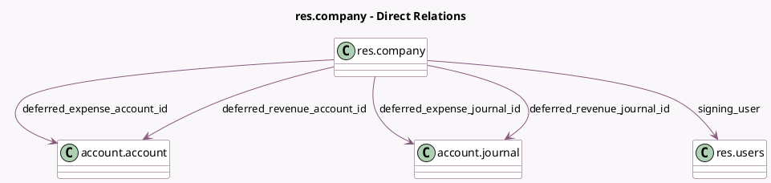

<!-- GENERATED:MODEL -->
---
tags: [odoo, enterprise, generated, model]
---

# res.company

- Module: [[docs/Enterprise Addons/account_accountant/account_accountant|account_accountant]]
- Scope: Enterprise Addons
- Defined in module: extension only
- Source files: `models/res_company.py`
- Python classes: `ResCompany`

## Field footprint

- Detected fields: 12
- Field types: `Boolean` x 2, `Date` x 1, `Many2one` x 5, `Selection` x 4
- Relation fields: 5

## Sample fields

- `deferred_expense_account_id`: `Many2one` (comodel `account.account`)
- `deferred_expense_amount_computation_method`: `Selection`
- `deferred_expense_journal_id`: `Many2one` (comodel `account.journal`)
- `deferred_revenue_account_id`: `Many2one` (comodel `account.account`)
- `deferred_revenue_amount_computation_method`: `Selection`
- `deferred_revenue_journal_id`: `Many2one` (comodel `account.journal`)
- `generate_deferred_expense_entries_method`: `Selection`
- `generate_deferred_revenue_entries_method`: `Selection`
- `invoicing_switch_threshold`: `Date`
- `predict_bill_product`: `Boolean`
- `sign_invoice`: `Boolean`
- `signing_user`: `Many2one` (comodel `res.users`)

## Method hints

- Detected methods: 3
- Action methods: none
- Compute methods: none
- Onchange methods: none

## Direct relation diagram

## Navigation

- **Parent:** [[docs/Enterprise Addons/account_accountant/Models]]

<!-- GENERATED:MODEL -->
