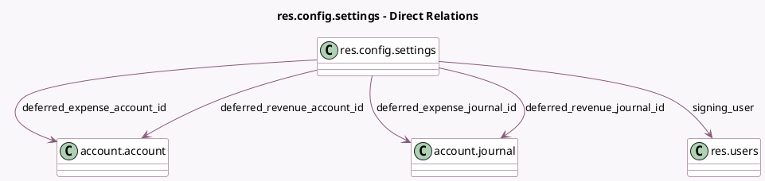

<!-- GENERATED:MODEL -->
---
tags: [odoo, enterprise, generated, model]
---

# res.config.settings

- Module: [[docs/Enterprise Addons/account_accountant/account_accountant|account_accountant]]
- Scope: Enterprise Addons
- Defined in module: extension only
- Source files: `models/res_config_settings.py`
- Python classes: `ResConfigSettings`

## Field footprint

- Detected fields: 18
- Field types: `Boolean` x 6, `Date` x 1, `Integer` x 1, `Many2one` x 5, `Selection` x 5
- Relation fields: 5

## Sample fields

- `deferred_expense_account_id`: `Many2one` (comodel `account.account`, related `company_id.deferred_expense_account_id`)
- `deferred_expense_amount_computation_method`: `Selection` (related `company_id.deferred_expense_amount_computation_method`)
- `deferred_expense_journal_id`: `Many2one` (comodel `account.journal`, related `company_id.deferred_expense_journal_id`)
- `deferred_revenue_account_id`: `Many2one` (comodel `account.account`, related `company_id.deferred_revenue_account_id`)
- `deferred_revenue_amount_computation_method`: `Selection` (related `company_id.deferred_revenue_amount_computation_method`)
- `deferred_revenue_journal_id`: `Many2one` (comodel `account.journal`, related `company_id.deferred_revenue_journal_id`)
- `fiscalyear_last_day`: `Integer` (related `company_id.fiscalyear_last_day`)
- `fiscalyear_last_month`: `Selection` (related `company_id.fiscalyear_last_month`)
- `generate_deferred_expense_entries_method`: `Selection` (related `company_id.generate_deferred_expense_entries_method`)
- `generate_deferred_revenue_entries_method`: `Selection` (related `company_id.generate_deferred_revenue_entries_method`)
- `group_fiscal_year`: `Boolean`
- `invoicing_switch_threshold`: `Date` (related `company_id.invoicing_switch_threshold`)
- `module_account_auto_transfer`: `Boolean`
- `module_sign`: `Boolean` (compute `_compute_module_sign_status`)
- `predict_bill_product`: `Boolean` (related `company_id.predict_bill_product`)
- `sign_invoice`: `Boolean` (related `company_id.sign_invoice`)
- `signing_user`: `Many2one` (comodel `res.users`, related `company_id.signing_user`)
- `use_anglo_saxon`: `Boolean` (related `company_id.anglo_saxon_accounting`)

## Method hints

- Detected methods: 3
- Action methods: none
- Compute methods: `_compute_module_sign_status`
- Onchange methods: none

## Direct relation diagram

## Navigation

- **Parent:** [[docs/Enterprise Addons/account_accountant/Models]]

<!-- GENERATED:MODEL -->
