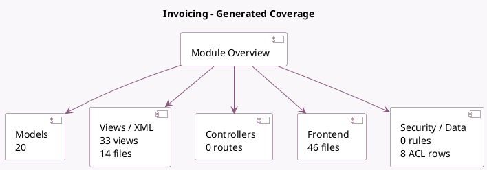

<!-- GENERATED:MODULE -->
---
tags: [odoo, enterprise, module]
---

# Invoicing

- Scope: Enterprise Addons
- Source: enterprise/account_accountant
- Dependencies: [[docs/Community Addons/account/account|account]], [[docs/Enterprise Addons/mail_enterprise/mail_enterprise|mail_enterprise]], [[docs/Community Addons/web_tour/web_tour|web_tour]]

## Summary

Invoices, Payments, Follow-ups & Bank synchronization (Enterprise)

## Generated coverage

- Models: 20
- XML files with UI/data artifacts: 14
- Views: 33
- Actions: 14
- Menus: 5
- Rules (ir.rule): 0
- Access CSV entries: 8
- Controller units: 0
- Frontend asset files: 46

## Module map

## Detail notes

- Models: [[docs/Enterprise Addons/account_accountant/Models|Models]] (20)
- Views and XML: [[docs/Enterprise Addons/account_accountant/Views|Views]] (14 files)
- Frontend: [[docs/Enterprise Addons/account_accountant/Frontend|Frontend]] (46 files)

## Key models

- `account.account`
- `account.auto.reconcile.wizard`
- `account.bank.statement`
- `account.bank.statement.line`
- `account.change.lock.date`
- `account.chart.template`
- `account.fiscal.year`
- `account.journal`
- `account.move`
- `account.move.line`
- `account.payment`
- `account.reconcile.model`

## Navigation

- [[../Enterprise Addons/Enterprise Addons|Back to scope]]
- [[../../docs/docs|Back to docs]]

<!-- GENERATED:MODULE -->

