<!-- GENERATED:MODEL -->
---
tags: [odoo, enterprise, generated, model]
---

# account.account

- Module: [[docs/Enterprise Addons/account_asset/account_asset|account_asset]]
- Scope: Enterprise Addons
- Defined in module: extension only
- Source files: `models/account.py`
- Python classes: `AccountAccount`

## Field footprint

- Detected fields: 5
- Field types: `Boolean` x 2, `Char` x 1, `Many2many` x 1, `Selection` x 1
- Relation fields: 1

## Sample fields

- `asset_model_ids`: `Many2many` (comodel `account.asset`)
- `can_create_asset`: `Boolean` (compute `_compute_can_create_asset`)
- `create_asset`: `Selection` (compute `_compute_create_asset`, store `True`)
- `form_view_ref`: `Char` (compute `_compute_can_create_asset`)
- `multiple_assets_per_line`: `Boolean`

## Method hints

- Detected methods: 3
- Action methods: none
- Compute methods: `_compute_can_create_asset`, `_compute_create_asset`
- Onchange methods: `_onchange_multiple_assets_per_line`

## Direct relation diagram

```plantuml
@startuml
!define ODOO_COLOR_PRIMARY #714B67
!define ODOO_COLOR_ACCENT #875A7B
!define ODOO_COLOR_BG #FAF7FA

skinparam backgroundColor ODOO_COLOR_BG
skinparam defaultTextAlignment left
skinparam ArrowColor ODOO_COLOR_ACCENT
skinparam ClassBackgroundColor white
skinparam ClassBorderColor ODOO_COLOR_PRIMARY
skinparam ComponentBackgroundColor white
skinparam ComponentBorderColor ODOO_COLOR_PRIMARY
skinparam NoteBackgroundColor #FFF8FF
skinparam NoteBorderColor ODOO_COLOR_ACCENT
skinparam SequenceLifeLineBorderColor ODOO_COLOR_ACCENT
skinparam SequenceLifeLineBackgroundColor #FFFFFF
skinparam SequenceParticipantBorderColor ODOO_COLOR_PRIMARY
skinparam SequenceParticipantBackgroundColor #FFFFFF
skinparam sequence {
  ArrowColor ODOO_COLOR_ACCENT
  ActorBorderColor ODOO_COLOR_PRIMARY
}
title account.account - Direct Relations
class "account.account" as account_account
class "account.asset" as account_asset
account_account .. account_asset : asset_model_ids
@enduml
```

## Navigation

- **Parent:** [[docs/Enterprise Addons/account_asset/Models]]

<!-- GENERATED:MODEL -->
