<!-- GENERATED:MODEL -->
---
tags: [odoo, enterprise, generated, model]
---

# account.asset.group

- Module: [[docs/Enterprise Addons/account_asset/account_asset|account_asset]]
- Scope: Enterprise Addons
- Defined in module: yes
- Source files: `models/account_asset_group.py`
- Python classes: `AccountAssetGroup`
- Description: Asset Group

## Field footprint

- Detected fields: 4
- Field types: `Char` x 1, `Integer` x 1, `Many2one` x 1, `One2many` x 1
- Relation fields: 2

## Sample fields

- `company_id`: `Many2one` (comodel `res.company`)
- `count_linked_assets`: `Integer` (compute `_compute_count_linked_asset`)
- `linked_asset_ids`: `One2many` (comodel `account.asset`)
- `name`: `Char` (comodel `Name`)

## Method hints

- Detected methods: 2
- Action methods: `action_open_linked_assets`
- Compute methods: `_compute_count_linked_asset`
- Onchange methods: none

## Direct relation diagram

```plantuml
@startuml
!define ODOO_COLOR_PRIMARY #714B67
!define ODOO_COLOR_ACCENT #875A7B
!define ODOO_COLOR_BG #FAF7FA

skinparam backgroundColor ODOO_COLOR_BG
skinparam defaultTextAlignment left
skinparam ArrowColor ODOO_COLOR_ACCENT
skinparam ClassBackgroundColor white
skinparam ClassBorderColor ODOO_COLOR_PRIMARY
skinparam ComponentBackgroundColor white
skinparam ComponentBorderColor ODOO_COLOR_PRIMARY
skinparam NoteBackgroundColor #FFF8FF
skinparam NoteBorderColor ODOO_COLOR_ACCENT
skinparam SequenceLifeLineBorderColor ODOO_COLOR_ACCENT
skinparam SequenceLifeLineBackgroundColor #FFFFFF
skinparam SequenceParticipantBorderColor ODOO_COLOR_PRIMARY
skinparam SequenceParticipantBackgroundColor #FFFFFF
skinparam sequence {
  ArrowColor ODOO_COLOR_ACCENT
  ActorBorderColor ODOO_COLOR_PRIMARY
}
title account.asset.group - Direct Relations
class "account.asset.group" as account_asset_group
class "account.asset" as account_asset
class "res.company" as res_company
account_asset_group --> res_company : company_id
account_asset_group --|> account_asset : linked_asset_ids
@enduml
```

## Navigation

- **Parent:** [[docs/Enterprise Addons/account_asset/Models]]

<!-- GENERATED:MODEL -->
