<!-- GENERATED:MODEL -->
---
tags: [odoo, enterprise, generated, model]
---

# account.asset

- Module: [[docs/Enterprise Addons/account_asset/account_asset|account_asset]]
- Scope: Enterprise Addons
- Defined in module: yes
- Source files: `models/account_asset.py`
- Python classes: `AccountAsset`
- Description: Asset/Revenue Recognition
- Inherits: `analytic.mixin`, `mail.activity.mixin`, `mail.thread`

## Field footprint

- Detected fields: 48
- Field types: `Boolean` x 3, `Char` x 2, `Date` x 4, `Float` x 4, `Integer` x 5, `Many2many` x 1, `Many2one` x 9, `Monetary` x 10, `One2many` x 3, `Properties` x 1, `PropertiesDefinition` x 1, `Selection` x 5
- Relation fields: 13

## Sample fields

- `account_asset_id`: `Many2one` (comodel `account.account`, compute `_compute_account_asset_id`, store `True`)
- `account_depreciation_expense_id`: `Many2one` (comodel `account.account`)
- `account_depreciation_id`: `Many2one` (comodel `account.account`)
- `account_type`: `Selection` (related `account_asset_id.account_type`)
- `acquisition_date`: `Date` (compute `_compute_acquisition_date`, store `True`)
- `active`: `Boolean`
- `already_depreciated_amount_import`: `Monetary`
- `asset_group_id`: `Many2one` (comodel `account.asset.group`)
- `asset_lifetime_days`: `Float` (compute `_compute_lifetime_days`)
- `asset_paused_days`: `Float`
- `asset_properties`: `Properties` (comodel `Properties`)
- `asset_properties_definition`: `PropertiesDefinition` (comodel `Model Properties`)
- `book_value`: `Monetary` (compute `_compute_book_value`, store `True`)
- `children_ids`: `One2many` (comodel `account.asset`)
- `company_id`: `Many2one` (comodel `res.company`)
- `count_linked_asset`: `Integer` (compute `_compute_linked_assets`)
- `country_code`: `Char` (related `company_id.account_fiscal_country_id.code`)
- `currency_id`: `Many2one` (comodel `res.currency`, related `company_id.currency_id`, store `True`)
- `depreciation_entries_count`: `Integer` (compute `_compute_counts`)
- `depreciation_move_ids`: `One2many` (comodel `account.move`)

## Method hints

- Detected methods: 65
- Action methods: `action_asset_modify`, `action_open_linked_assets`, `action_save_model`
- Compute methods: `_compute_account_asset_id`, `_compute_acquisition_date`, `_compute_analytic_distribution`, `_compute_board_amount`, `_compute_book_value`, `_compute_counts`, `_compute_display_account_asset_id`, `_compute_disposal_date`, and 13 more
- Onchange methods: `_display_original_value_warning`, `_onchange_account_asset_id`, `_onchange_account_depreciation_id`, `_onchange_model_id`, `_onchange_original_move_line_ids`, `onchange_consistent_board`

## Direct relation diagram

```plantuml
@startuml
!define ODOO_COLOR_PRIMARY #714B67
!define ODOO_COLOR_ACCENT #875A7B
!define ODOO_COLOR_BG #FAF7FA

skinparam backgroundColor ODOO_COLOR_BG
skinparam defaultTextAlignment left
skinparam ArrowColor ODOO_COLOR_ACCENT
skinparam ClassBackgroundColor white
skinparam ClassBorderColor ODOO_COLOR_PRIMARY
skinparam ComponentBackgroundColor white
skinparam ComponentBorderColor ODOO_COLOR_PRIMARY
skinparam NoteBackgroundColor #FFF8FF
skinparam NoteBorderColor ODOO_COLOR_ACCENT
skinparam SequenceLifeLineBorderColor ODOO_COLOR_ACCENT
skinparam SequenceLifeLineBackgroundColor #FFFFFF
skinparam SequenceParticipantBorderColor ODOO_COLOR_PRIMARY
skinparam SequenceParticipantBackgroundColor #FFFFFF
skinparam sequence {
  ArrowColor ODOO_COLOR_ACCENT
  ActorBorderColor ODOO_COLOR_PRIMARY
}
title account.asset - Direct Relations
class "account.asset" as account_asset
class "account.account" as account_account
class "account.asset" as account_asset
class "account.asset.group" as account_asset_group
class "account.journal" as account_journal
class "account.move" as account_move
class "account.move.line" as account_move_line
class "res.company" as res_company
class "res.currency" as res_currency
account_asset --> res_company : company_id
account_asset --> res_currency : currency_id
account_asset --> account_account : account_asset_id
account_asset --> account_asset_group : asset_group_id
account_asset --> account_account : account_depreciation_id
account_asset --> account_account : account_depreciation_expense_id
account_asset --> account_journal : journal_id
account_asset --|> account_move : depreciation_move_ids
account_asset .. account_move_line : original_move_line_ids
account_asset --> account_asset : model_id
account_asset --> account_asset : parent_id
account_asset --|> account_asset : children_ids
account_asset --|> account_asset : linked_assets_ids
@enduml
```

## Navigation

- **Parent:** [[docs/Enterprise Addons/account_asset/Models]]

<!-- GENERATED:MODEL -->
