<!-- GENERATED:MODEL -->
---
tags: [odoo, enterprise, generated, model]
---

# account.move

- Module: [[docs/Enterprise Addons/account_asset/account_asset|account_asset]]
- Scope: Enterprise Addons
- Defined in module: extension only
- Source files: `models/account_move.py`
- Python classes: `AccountMove`

## Field footprint

- Detected fields: 12
- Field types: `Boolean` x 2, `Char` x 1, `Date` x 1, `Integer` x 2, `Many2one` x 1, `Monetary` x 3, `One2many` x 1, `Selection` x 1
- Relation fields: 2

## Sample fields

- `asset_depreciated_value`: `Monetary` (compute `_compute_depreciation_cumulative_value`)
- `asset_depreciation_beginning_date`: `Date`
- `asset_id`: `Many2one` (comodel `account.asset`)
- `asset_id_display_name`: `Char` (compute `_compute_asset_ids`)
- `asset_ids`: `One2many` (comodel `account.asset`, compute `_compute_asset_ids`)
- `asset_move_type`: `Selection` (compute `_compute_asset_move_type`, store `True`)
- `asset_number_days`: `Integer`
- `asset_remaining_value`: `Monetary` (compute `_compute_depreciation_cumulative_value`)
- `asset_value_change`: `Boolean`
- `count_asset`: `Integer` (compute `_compute_asset_ids`)
- `depreciation_value`: `Monetary` (compute `_compute_depreciation_value`, store `True`)
- `draft_asset_exists`: `Boolean` (compute `_compute_asset_ids`)

## Method hints

- Detected methods: 16
- Action methods: `action_open_asset_ids`
- Compute methods: `_compute_asset_ids`, `_compute_asset_move_type`, `_compute_depreciation_cumulative_value`, `_compute_depreciation_value`
- Onchange methods: none

## Direct relation diagram

```plantuml
@startuml
!define ODOO_COLOR_PRIMARY #714B67
!define ODOO_COLOR_ACCENT #875A7B
!define ODOO_COLOR_BG #FAF7FA

skinparam backgroundColor ODOO_COLOR_BG
skinparam defaultTextAlignment left
skinparam ArrowColor ODOO_COLOR_ACCENT
skinparam ClassBackgroundColor white
skinparam ClassBorderColor ODOO_COLOR_PRIMARY
skinparam ComponentBackgroundColor white
skinparam ComponentBorderColor ODOO_COLOR_PRIMARY
skinparam NoteBackgroundColor #FFF8FF
skinparam NoteBorderColor ODOO_COLOR_ACCENT
skinparam SequenceLifeLineBorderColor ODOO_COLOR_ACCENT
skinparam SequenceLifeLineBackgroundColor #FFFFFF
skinparam SequenceParticipantBorderColor ODOO_COLOR_PRIMARY
skinparam SequenceParticipantBackgroundColor #FFFFFF
skinparam sequence {
  ArrowColor ODOO_COLOR_ACCENT
  ActorBorderColor ODOO_COLOR_PRIMARY
}
title account.move - Direct Relations
class "account.move" as account_move
class "account.asset" as account_asset
account_move --> account_asset : asset_id
account_move --|> account_asset : asset_ids
@enduml
```

## Navigation

- **Parent:** [[docs/Enterprise Addons/account_asset/Models]]

<!-- GENERATED:MODEL -->
