<!-- GENERATED:MODEL -->
---
tags: [odoo, enterprise, generated, model]
---

# asset.modify

- Module: [[docs/Enterprise Addons/account_asset/account_asset|account_asset]]
- Scope: Enterprise Addons
- Defined in module: yes
- Source files: `wizard/asset_modify.py`
- Python classes: `AssetModify`
- Description: Modify Asset

## Field footprint

- Detected fields: 22
- Field types: `Boolean` x 2, `Date` x 1, `Html` x 1, `Integer` x 1, `Many2many` x 2, `Many2one` x 9, `Monetary` x 2, `Selection` x 3, `Text` x 1
- Relation fields: 11

## Sample fields

- `account_asset_counterpart_id`: `Many2one` (comodel `account.account`)
- `account_asset_id`: `Many2one` (comodel `account.account`)
- `account_depreciation_expense_id`: `Many2one` (comodel `account.account`)
- `account_depreciation_id`: `Many2one` (comodel `account.account`)
- `asset_id`: `Many2one` (comodel `account.asset`)
- `company_id`: `Many2one` (comodel `res.company`, related `asset_id.company_id`)
- `currency_id`: `Many2one` (related `asset_id.currency_id`)
- `date`: `Date`
- `gain_account_id`: `Many2one` (comodel `account.account`, compute `_compute_accounts`)
- `gain_or_loss`: `Selection` (compute `_compute_gain_or_loss`)
- `gain_value`: `Boolean` (compute `_compute_gain_value`)
- `informational_text`: `Html` (compute `_compute_informational_text`)
- `invoice_ids`: `Many2many` (comodel `account.move`)
- `invoice_line_ids`: `Many2many` (comodel `account.move.line`)
- `loss_account_id`: `Many2one` (comodel `account.account`, compute `_compute_accounts`)
- `method_number`: `Integer`
- `method_period`: `Selection`
- `modify_action`: `Selection`
- `name`: `Text`
- `salvage_value`: `Monetary`

## Method hints

- Detected methods: 19
- Action methods: none
- Compute methods: `_compute_accounts`, `_compute_gain_or_loss`, `_compute_gain_value`, `_compute_informational_text`, `_compute_modify_action`, `_compute_select_invoice_line_id`, `_compute_value_residual`
- Onchange methods: `_onchange_action`, `_onchange_invoice_ids`

## Direct relation diagram

```plantuml
@startuml
!define ODOO_COLOR_PRIMARY #714B67
!define ODOO_COLOR_ACCENT #875A7B
!define ODOO_COLOR_BG #FAF7FA

skinparam backgroundColor ODOO_COLOR_BG
skinparam defaultTextAlignment left
skinparam ArrowColor ODOO_COLOR_ACCENT
skinparam ClassBackgroundColor white
skinparam ClassBorderColor ODOO_COLOR_PRIMARY
skinparam ComponentBackgroundColor white
skinparam ComponentBorderColor ODOO_COLOR_PRIMARY
skinparam NoteBackgroundColor #FFF8FF
skinparam NoteBorderColor ODOO_COLOR_ACCENT
skinparam SequenceLifeLineBorderColor ODOO_COLOR_ACCENT
skinparam SequenceLifeLineBackgroundColor #FFFFFF
skinparam SequenceParticipantBorderColor ODOO_COLOR_PRIMARY
skinparam SequenceParticipantBackgroundColor #FFFFFF
skinparam sequence {
  ArrowColor ODOO_COLOR_ACCENT
  ActorBorderColor ODOO_COLOR_PRIMARY
}
title asset.modify - Direct Relations
class "asset.modify" as asset_modify
class "account.account" as account_account
class "account.asset" as account_asset
class "account.move" as account_move
class "account.move.line" as account_move_line
class "res.company" as res_company
asset_modify --> account_asset : asset_id
asset_modify --> account_account : account_asset_id
asset_modify --> account_account : account_asset_counterpart_id
asset_modify --> account_account : account_depreciation_id
asset_modify --> account_account : account_depreciation_expense_id
asset_modify --> res_company : company_id
asset_modify .. account_move : invoice_ids
asset_modify .. account_move_line : invoice_line_ids
asset_modify --> account_account : gain_account_id
asset_modify --> account_account : loss_account_id
@enduml
```

## Navigation

- **Parent:** [[docs/Enterprise Addons/account_asset/Models]]

<!-- GENERATED:MODEL -->
