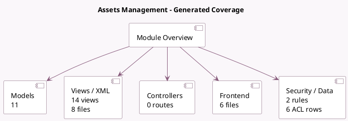

<!-- GENERATED:MODULE -->
---
tags: [odoo, enterprise, module]
---

# Assets Management

- Scope: Enterprise Addons
- Source: enterprise/account_asset
- Dependencies: [[docs/Enterprise Addons/accountant/accountant|accountant]]

## Generated coverage

- Models: 11
- XML files with UI/data artifacts: 8
- Views: 14
- Actions: 7
- Menus: 4
- Rules (ir.rule): 2
- Access CSV entries: 6
- Controller units: 0
- Frontend asset files: 6

## Module map

## Detail notes

- Models: [[docs/Enterprise Addons/account_asset/Models|Models]] (11)
- Views and XML: [[docs/Enterprise Addons/account_asset/Views|Views]] (8 files)
- Frontend: [[docs/Enterprise Addons/account_asset/Frontend|Frontend]] (6 files)

## Key models

- `account.account`
- `account.asset`
- `account.asset.group`
- `account.asset.report.handler`
- `account.chart.template`
- `account.move`
- `account.move.line`
- `account.report`
- `account.return`
- `asset.modify`
- `res.company`

## Navigation

- [[../Enterprise Addons/Enterprise Addons|Back to scope]]
- [[../../docs/docs|Back to docs]]

<!-- GENERATED:MODULE -->

## Curated analysis

### Functional role
- `account_asset` adds the fixed-asset lifecycle on top of accounting: asset recognition, depreciation schedules, revaluation, disposal, and audit-oriented reporting.
- Asset groups and report handlers make the module operationally closer to a finance control surface than to a simple master-data addon.

### Operational footprint
- `account_asset.py` contains the main depreciation logic, while `account_move.py` bridges posted entries and asset creation.
- The module also ships a dedicated report handler, an asset modification wizard, and a template download controller for bulk asset loading.

### Evidence
- Source files: `enterprise/account_asset/models/account_asset.py`, `enterprise/account_asset/models/account_move.py`, `enterprise/account_asset/models/account_assets_report.py`
- UI and automation: `enterprise/account_asset/views/account_asset_views.xml`, `enterprise/account_asset/views/account_asset_group_views.xml`, `enterprise/account_asset/wizard/asset_modify.py`
- Security and tests: `enterprise/account_asset/security/account_asset_security.xml`, `enterprise/account_asset/tests/test_account_asset.py`, `enterprise/account_asset/tests/test_reevaluation_asset.py`

### Related notes
- `[[docs/Enterprise Addons/account_reports/account_reports|account_reports]]`
- `[[docs/Core/Master Data/res_company]]`

### Rollout and migration concerns
- Activating this module on a live database requires validated company accounts, journals, and depreciation policies before importing or generating any asset entries.
- Reevaluation and disposal flows create accounting side effects that finance teams usually expect to review in both journals and reports, so cutover plans need reconciliation checkpoints.
- Legacy comparison backlog was retired on 2026-03-02; keep this note focused on the current codebase.

