<!-- GENERATED:MODEL -->
---
tags: [odoo, enterprise, generated, model]
---

# account.asset

- Module: [[docs/Enterprise Addons/account_asset_fleet/account_asset_fleet|account_asset_fleet]]
- Scope: Enterprise Addons
- Defined in module: extension only
- Source files: `models/account_asset.py`
- Python classes: `AccountAsset`

## Field footprint

- Detected fields: 1
- Field types: `Many2one` x 1
- Relation fields: 1

## Sample fields

- `vehicle_id`: `Many2one` (comodel `fleet.vehicle`, compute `_compute_vehicle_id`, store `True`)

## Method hints

- Detected methods: 2
- Action methods: `action_open_vehicle`
- Compute methods: `_compute_vehicle_id`
- Onchange methods: none

## Direct relation diagram

```plantuml
@startuml
!define ODOO_COLOR_PRIMARY #714B67
!define ODOO_COLOR_ACCENT #875A7B
!define ODOO_COLOR_BG #FAF7FA

skinparam backgroundColor ODOO_COLOR_BG
skinparam defaultTextAlignment left
skinparam ArrowColor ODOO_COLOR_ACCENT
skinparam ClassBackgroundColor white
skinparam ClassBorderColor ODOO_COLOR_PRIMARY
skinparam ComponentBackgroundColor white
skinparam ComponentBorderColor ODOO_COLOR_PRIMARY
skinparam NoteBackgroundColor #FFF8FF
skinparam NoteBorderColor ODOO_COLOR_ACCENT
skinparam SequenceLifeLineBorderColor ODOO_COLOR_ACCENT
skinparam SequenceLifeLineBackgroundColor #FFFFFF
skinparam SequenceParticipantBorderColor ODOO_COLOR_PRIMARY
skinparam SequenceParticipantBackgroundColor #FFFFFF
skinparam sequence {
  ArrowColor ODOO_COLOR_ACCENT
  ActorBorderColor ODOO_COLOR_PRIMARY
}
title account.asset - Direct Relations
class "account.asset" as account_asset
class "fleet.vehicle" as fleet_vehicle
account_asset --> fleet_vehicle : vehicle_id
@enduml
```

## Navigation

- **Parent:** [[docs/Enterprise Addons/account_asset_fleet/Models]]

<!-- GENERATED:MODEL -->
