<!-- GENERATED:MODEL -->
---
tags: [odoo, enterprise, generated, model]
---

# account.fiscal.position

- Module: [[docs/Enterprise Addons/account_avatax/account_avatax|account_avatax]]
- Scope: Enterprise Addons
- Defined in module: extension only
- Source files: `models/account_fiscal_position.py`
- Python classes: `AccountFiscalPosition`

## Field footprint

- Detected fields: 3
- Field types: `Boolean` x 1, `Many2one` x 2
- Relation fields: 2

## Sample fields

- `avatax_invoice_account_id`: `Many2one` (comodel `account.account`)
- `avatax_refund_account_id`: `Many2one` (comodel `account.account`)
- `is_avatax`: `Boolean`

## Method hints

- Detected methods: 2
- Action methods: none
- Compute methods: none
- Onchange methods: none

## Direct relation diagram

```plantuml
@startuml
!define ODOO_COLOR_PRIMARY #714B67
!define ODOO_COLOR_ACCENT #875A7B
!define ODOO_COLOR_BG #FAF7FA

skinparam backgroundColor ODOO_COLOR_BG
skinparam defaultTextAlignment left
skinparam ArrowColor ODOO_COLOR_ACCENT
skinparam ClassBackgroundColor white
skinparam ClassBorderColor ODOO_COLOR_PRIMARY
skinparam ComponentBackgroundColor white
skinparam ComponentBorderColor ODOO_COLOR_PRIMARY
skinparam NoteBackgroundColor #FFF8FF
skinparam NoteBorderColor ODOO_COLOR_ACCENT
skinparam SequenceLifeLineBorderColor ODOO_COLOR_ACCENT
skinparam SequenceLifeLineBackgroundColor #FFFFFF
skinparam SequenceParticipantBorderColor ODOO_COLOR_PRIMARY
skinparam SequenceParticipantBackgroundColor #FFFFFF
skinparam sequence {
  ArrowColor ODOO_COLOR_ACCENT
  ActorBorderColor ODOO_COLOR_PRIMARY
}
title account.fiscal.position - Direct Relations
class "account.fiscal.position" as account_fiscal_position
class "account.account" as account_account
account_fiscal_position --> account_account : avatax_invoice_account_id
account_fiscal_position --> account_account : avatax_refund_account_id
@enduml
```

## Navigation

- **Parent:** [[docs/Enterprise Addons/account_avatax/Models]]

<!-- GENERATED:MODEL -->
