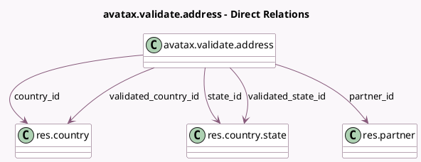

<!-- GENERATED:MODEL -->
---
tags: [odoo, enterprise, generated, model]
---

# avatax.validate.address

- Module: [[docs/Enterprise Addons/account_avatax/account_avatax|account_avatax]]
- Scope: Enterprise Addons
- Defined in module: yes
- Source files: `wizard/avatax_validate_address.py`
- Python classes: `AvataxValidateAddress`
- Description: Suggests validated addresses from Avatax

## Field footprint

- Detected fields: 16
- Field types: `Boolean` x 1, `Char` x 8, `Float` x 2, `Many2one` x 5
- Relation fields: 5

## Sample fields

- `city`: `Char` (related `partner_id.city`)
- `country_id`: `Many2one` (comodel `res.country`, related `partner_id.country_id`)
- `is_already_valid`: `Boolean` (compute `_compute_validated_address`)
- `partner_id`: `Many2one` (comodel `res.partner`)
- `state_id`: `Many2one` (comodel `res.country.state`, related `partner_id.state_id`)
- `street`: `Char` (related `partner_id.street`)
- `street2`: `Char` (related `partner_id.street2`)
- `validated_city`: `Char` (compute `_compute_validated_address`)
- `validated_country_id`: `Many2one` (comodel `res.country`, compute `_compute_validated_address`)
- `validated_latitude`: `Float` (compute `_compute_validated_address`)
- `validated_longitude`: `Float` (compute `_compute_validated_address`)
- `validated_state_id`: `Many2one` (comodel `res.country.state`, compute `_compute_validated_address`)
- `validated_street`: `Char` (compute `_compute_validated_address`)
- `validated_street2`: `Char` (compute `_compute_validated_address`)
- `validated_zip`: `Char` (compute `_compute_validated_address`)
- `zip`: `Char` (related `partner_id.zip`)

## Method hints

- Detected methods: 2
- Action methods: `action_save_validated`
- Compute methods: `_compute_validated_address`
- Onchange methods: none

## Direct relation diagram

## Navigation

- **Parent:** [[docs/Enterprise Addons/account_avatax/Models]]

<!-- GENERATED:MODEL -->
