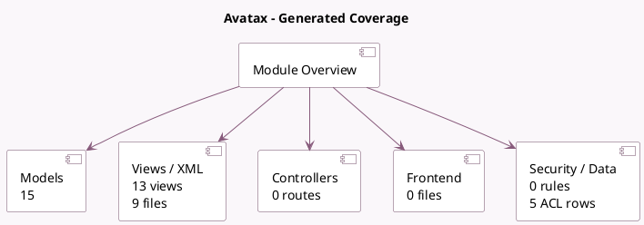

<!-- GENERATED:MODULE -->
---
tags: [odoo, enterprise, module]
---

# Avatax

- Scope: Enterprise Addons
- Source: enterprise/account_avatax
- Dependencies: [[docs/Community Addons/payment/payment|payment]], [[docs/Enterprise Addons/account_external_tax/account_external_tax|account_external_tax]]

## Generated coverage

- Models: 15
- XML files with UI/data artifacts: 9
- Views: 13
- Actions: 1
- Menus: 0
- Rules (ir.rule): 0
- Access CSV entries: 5
- Controller units: 0
- Frontend asset files: 0

## Module map

## Detail notes

- Models: [[docs/Enterprise Addons/account_avatax/Models|Models]] (15)
- Views and XML: [[docs/Enterprise Addons/account_avatax/Views|Views]] (9 files)

## Key models

- `account.avatax.unique.code`
- `account.chart.template`
- `account.external.tax.mixin`
- `account.fiscal.position`
- `account.move`
- `avatax.connection.test.result`
- `avatax.exemption`
- `avatax.validate.address`
- `product.avatax.category`
- `product.category`
- `product.product`
- `product.template`

## Navigation

- [[../Enterprise Addons/Enterprise Addons|Back to scope]]
- [[../../docs/docs|Back to docs]]

<!-- GENERATED:MODULE -->

