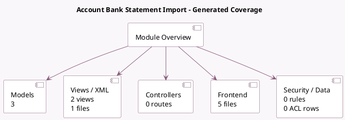

<!-- GENERATED:MODULE -->
---
tags: [odoo, enterprise, module]
---

# Account Bank Statement Import

- Scope: Enterprise Addons
- Source: enterprise/account_bank_statement_import
- Dependencies: [[docs/Enterprise Addons/account_accountant/account_accountant|account_accountant]], [[docs/Community Addons/base_import/base_import|base_import]]

## Generated coverage

- Models: 3
- XML files with UI/data artifacts: 1
- Views: 2
- Actions: 0
- Menus: 0
- Rules (ir.rule): 0
- Access CSV entries: 0
- Controller units: 0
- Frontend asset files: 5

## Module map

## Detail notes

- Models: [[docs/Enterprise Addons/account_bank_statement_import/Models|Models]] (3)
- Views and XML: [[docs/Enterprise Addons/account_bank_statement_import/Views|Views]] (1 files)
- Frontend: [[docs/Enterprise Addons/account_bank_statement_import/Frontend|Frontend]] (5 files)

## Key models

- `account.bank.statement.line`
- `account.journal`
- `account.setup.bank.manual.config`

## Navigation

- [[../Enterprise Addons/Enterprise Addons|Back to scope]]
- [[../../docs/docs|Back to docs]]

<!-- GENERATED:MODULE -->

