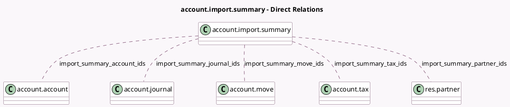

<!-- GENERATED:MODEL -->
---
tags: [odoo, enterprise, generated, model]
---

# account.import.summary

- Module: [[docs/Enterprise Addons/account_base_import/account_base_import|account_base_import]]
- Scope: Enterprise Addons
- Defined in module: yes
- Source files: `wizard/account_import_summary.py`
- Python classes: `AccountImportSummary`
- Description: Account import summary view

## Field footprint

- Detected fields: 12
- Field types: `Boolean` x 1, `Char` x 1, `Integer` x 5, `Many2many` x 5
- Relation fields: 5

## Sample fields

- `import_summary_account_ids`: `Many2many` (comodel `account.account`)
- `import_summary_have_data`: `Boolean` (compute `_compute_import_summary_have_data`)
- `import_summary_journal_ids`: `Many2many` (comodel `account.journal`)
- `import_summary_len_account`: `Integer` (compute `_compute_import_summary_len_account`)
- `import_summary_len_journal`: `Integer` (compute `_compute_import_summary_len_journal`)
- `import_summary_len_move`: `Integer` (compute `_compute_import_summary_len_move`)
- `import_summary_len_partner`: `Integer` (compute `_compute_import_summary_len_partner`)
- `import_summary_len_tax`: `Integer` (compute `_compute_import_summary_len_tax`)
- `import_summary_move_ids`: `Many2many` (comodel `account.move`)
- `import_summary_name`: `Char`
- `import_summary_partner_ids`: `Many2many` (comodel `res.partner`)
- `import_summary_tax_ids`: `Many2many` (comodel `account.tax`)

## Method hints

- Detected methods: 12
- Action methods: `action_open_account_view`, `action_open_journal_view`, `action_open_move_view`, `action_open_partner_view`, `action_open_summary_view`, `action_open_tax_view`
- Compute methods: `_compute_import_summary_have_data`, `_compute_import_summary_len_account`, `_compute_import_summary_len_journal`, `_compute_import_summary_len_move`, `_compute_import_summary_len_partner`, `_compute_import_summary_len_tax`
- Onchange methods: none

## Direct relation diagram

## Navigation

- **Parent:** [[docs/Enterprise Addons/account_base_import/Models]]

<!-- GENERATED:MODEL -->
