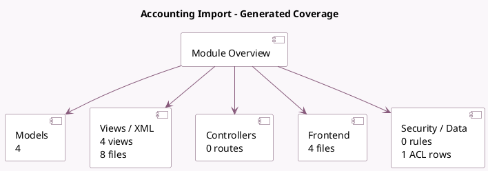

<!-- GENERATED:MODULE -->
---
tags: [odoo, enterprise, module]
---

# Accounting Import

- Scope: Enterprise Addons
- Source: enterprise/account_base_import
- Dependencies: [[docs/Enterprise Addons/account_accountant/account_accountant|account_accountant]], [[docs/Community Addons/base_import/base_import|base_import]], [[docs/Enterprise Addons/account_asset/account_asset|account_asset]]

## Summary

Improved Import in Accounting

## Generated coverage

- Models: 4
- XML files with UI/data artifacts: 8
- Views: 4
- Actions: 6
- Menus: 0
- Rules (ir.rule): 0
- Access CSV entries: 1
- Controller units: 0
- Frontend asset files: 4

## Module map

## Detail notes

- Models: [[docs/Enterprise Addons/account_base_import/Models|Models]] (4)
- Views and XML: [[docs/Enterprise Addons/account_base_import/Views|Views]] (8 files)
- Frontend: [[docs/Enterprise Addons/account_base_import/Frontend|Frontend]] (4 files)

## Key models

- `account.account`
- `account.import.summary`
- `account.move.line`
- `base_import.import`

## Navigation

- [[../Enterprise Addons/Enterprise Addons|Back to scope]]
- [[../../docs/docs|Back to docs]]

<!-- GENERATED:MODULE -->

