<!-- GENERATED:MODEL -->
---
tags: [odoo, enterprise, generated, model]
---

# account.batch.error.wizard

- Module: [[docs/Enterprise Addons/account_batch_payment/account_batch_payment|account_batch_payment]]
- Scope: Enterprise Addons
- Defined in module: yes
- Source files: `wizard/batch_error.py`
- Python classes: `AccountBatchErrorWizard`
- Description: Batch payments error reporting wizard

## Field footprint

- Detected fields: 4
- Field types: `Boolean` x 1, `Many2one` x 1, `One2many` x 2
- Relation fields: 3

## Sample fields

- `batch_payment_id`: `Many2one` (comodel `account.batch.payment`)
- `error_line_ids`: `One2many` (comodel `account.batch.error.wizard.line`)
- `show_remove_options`: `Boolean`
- `warning_line_ids`: `One2many` (comodel `account.batch.error.wizard.line`)

## Method hints

- Detected methods: 3
- Action methods: none
- Compute methods: none
- Onchange methods: none

## Direct relation diagram

```plantuml
@startuml
!define ODOO_COLOR_PRIMARY #714B67
!define ODOO_COLOR_ACCENT #875A7B
!define ODOO_COLOR_BG #FAF7FA

skinparam backgroundColor ODOO_COLOR_BG
skinparam defaultTextAlignment left
skinparam ArrowColor ODOO_COLOR_ACCENT
skinparam ClassBackgroundColor white
skinparam ClassBorderColor ODOO_COLOR_PRIMARY
skinparam ComponentBackgroundColor white
skinparam ComponentBorderColor ODOO_COLOR_PRIMARY
skinparam NoteBackgroundColor #FFF8FF
skinparam NoteBorderColor ODOO_COLOR_ACCENT
skinparam SequenceLifeLineBorderColor ODOO_COLOR_ACCENT
skinparam SequenceLifeLineBackgroundColor #FFFFFF
skinparam SequenceParticipantBorderColor ODOO_COLOR_PRIMARY
skinparam SequenceParticipantBackgroundColor #FFFFFF
skinparam sequence {
  ArrowColor ODOO_COLOR_ACCENT
  ActorBorderColor ODOO_COLOR_PRIMARY
}
title account.batch.error.wizard - Direct Relations
class "account.batch.error.wizard" as account_batch_error_wizard
class "account.batch.error.wizard.line" as account_batch_error_wizard_line
class "account.batch.payment" as account_batch_payment
account_batch_error_wizard --> account_batch_payment : batch_payment_id
account_batch_error_wizard --|> account_batch_error_wizard_line : error_line_ids
account_batch_error_wizard --|> account_batch_error_wizard_line : warning_line_ids
@enduml
```

## Navigation

- **Parent:** [[docs/Enterprise Addons/account_batch_payment/Models]]

<!-- GENERATED:MODEL -->
