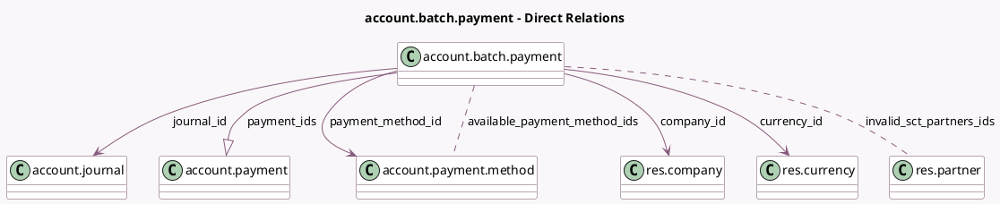

<!-- GENERATED:MODEL -->
---
tags: [odoo, enterprise, generated, model]
---

# account.batch.payment

- Module: [[docs/Enterprise Addons/account_batch_payment/account_batch_payment|account_batch_payment]]
- Scope: Enterprise Addons
- Defined in module: yes
- Source files: `models/account_batch_payment.py`
- Python classes: `AccountBatchPayment`
- Description: Batch Payment
- Inherits: `mail.activity.mixin`, `mail.thread`

## Field footprint

- Detected fields: 21
- Field types: `Binary` x 1, `Boolean` x 1, `Char` x 4, `Date` x 2, `Many2many` x 2, `Many2one` x 5, `Monetary` x 3, `One2many` x 1, `Selection` x 2
- Relation fields: 8

## Sample fields

- `amount`: `Monetary` (compute `_compute_from_payment_ids`, store `True`)
- `amount_residual`: `Monetary` (compute `_compute_from_payment_ids`, store `True`)
- `amount_residual_currency`: `Monetary` (compute `_compute_from_payment_ids`, store `True`)
- `available_payment_method_ids`: `Many2many` (comodel `account.payment.method`, compute `_compute_available_payment_method_ids`)
- `batch_type`: `Selection`
- `company_currency_id`: `Many2one` (related `journal_id.company_id.currency_id`, store `True`)
- `company_id`: `Many2one` (comodel `res.company`, related `journal_id.company_id`)
- `currency_id`: `Many2one` (comodel `res.currency`, compute `_compute_currency`, store `True`)
- `date`: `Date`
- `export_file`: `Binary`
- `export_file_create_date`: `Date`
- `export_filename`: `Char` (store `True`)
- `file_generation_enabled`: `Boolean` (compute `_compute_file_generation_enabled`)
- `invalid_sct_partners_ids`: `Many2many` (comodel `res.partner`, compute `_compute_invalid_sct_partners_ids`)
- `journal_id`: `Many2one` (comodel `account.journal`)
- `name`: `Char`
- `payment_ids`: `One2many` (comodel `account.payment`)
- `payment_ids_domain`: `Char` (compute `_compute_payment_ids_domain`)
- `payment_method_code`: `Char` (related `payment_method_id.code`)
- `payment_method_id`: `Many2one` (comodel `account.payment.method`, compute `_compute_payment_method_id`, store `True`)

## Method hints

- Detected methods: 28
- Action methods: `action_invalid_partners_from_sct`
- Compute methods: `_compute_available_payment_method_ids`, `_compute_currency`, `_compute_display_name`, `_compute_file_generation_enabled`, `_compute_from_payment_ids`, `_compute_invalid_sct_partners_ids`, `_compute_payment_ids_domain`, `_compute_payment_method_id`, and 1 more
- Onchange methods: none

## Direct relation diagram

## Navigation

- **Parent:** [[docs/Enterprise Addons/account_batch_payment/Models]]

<!-- GENERATED:MODEL -->
