<!-- GENERATED:MODEL -->
---
tags: [odoo, enterprise, generated, model]
---

# account.create.batch.error.wizard

- Module: [[docs/Enterprise Addons/account_batch_payment/account_batch_payment|account_batch_payment]]
- Scope: Enterprise Addons
- Defined in module: yes
- Source files: `wizard/create_batch_error.py`
- Python classes: `CreateBatchErrorWizard`
- Description: Create Batch Payment Error Wizard

## Field footprint

- Detected fields: 3
- Field types: `Boolean` x 1, `Char` x 1, `Many2many` x 1
- Relation fields: 1

## Sample fields

- `error_message`: `Char` (compute `_compute_error_message`)
- `has_valid_payments`: `Boolean` (compute `_compute_has_valid_payments`)
- `payment_ids`: `Many2many` (comodel `account.payment`)

## Method hints

- Detected methods: 4
- Action methods: `action_create_batch`, `action_open_invalid_payments`
- Compute methods: `_compute_error_message`, `_compute_has_valid_payments`
- Onchange methods: none

## Direct relation diagram

```plantuml
@startuml
!define ODOO_COLOR_PRIMARY #714B67
!define ODOO_COLOR_ACCENT #875A7B
!define ODOO_COLOR_BG #FAF7FA

skinparam backgroundColor ODOO_COLOR_BG
skinparam defaultTextAlignment left
skinparam ArrowColor ODOO_COLOR_ACCENT
skinparam ClassBackgroundColor white
skinparam ClassBorderColor ODOO_COLOR_PRIMARY
skinparam ComponentBackgroundColor white
skinparam ComponentBorderColor ODOO_COLOR_PRIMARY
skinparam NoteBackgroundColor #FFF8FF
skinparam NoteBorderColor ODOO_COLOR_ACCENT
skinparam SequenceLifeLineBorderColor ODOO_COLOR_ACCENT
skinparam SequenceLifeLineBackgroundColor #FFFFFF
skinparam SequenceParticipantBorderColor ODOO_COLOR_PRIMARY
skinparam SequenceParticipantBackgroundColor #FFFFFF
skinparam sequence {
  ArrowColor ODOO_COLOR_ACCENT
  ActorBorderColor ODOO_COLOR_PRIMARY
}
title account.create.batch.error.wizard - Direct Relations
class "account.create.batch.error.wizard" as account_create_batch_error_wizard
class "account.payment" as account_payment
account_create_batch_error_wizard .. account_payment : payment_ids
@enduml
```

## Navigation

- **Parent:** [[docs/Enterprise Addons/account_batch_payment/Models]]

<!-- GENERATED:MODEL -->
