<!-- GENERATED:MODEL -->
---
tags: [odoo, enterprise, generated, model]
---

# account.payment

- Module: [[docs/Enterprise Addons/account_batch_payment/account_batch_payment|account_batch_payment]]
- Scope: Enterprise Addons
- Defined in module: extension only
- Source files: `models/account_payment.py`
- Python classes: `AccountPayment`

## Field footprint

- Detected fields: 3
- Field types: `Char` x 1, `Many2one` x 1, `Monetary` x 1
- Relation fields: 1

## Sample fields

- `amount_signed`: `Monetary` (compute `_compute_amount_signed`)
- `batch_payment_id`: `Many2one` (comodel `account.batch.payment`)
- `payment_method_name`: `Char` (related `payment_method_line_id.name`)

## Method hints

- Detected methods: 4
- Action methods: none
- Compute methods: `_compute_amount_signed`
- Onchange methods: none

## Direct relation diagram

```plantuml
@startuml
!define ODOO_COLOR_PRIMARY #714B67
!define ODOO_COLOR_ACCENT #875A7B
!define ODOO_COLOR_BG #FAF7FA

skinparam backgroundColor ODOO_COLOR_BG
skinparam defaultTextAlignment left
skinparam ArrowColor ODOO_COLOR_ACCENT
skinparam ClassBackgroundColor white
skinparam ClassBorderColor ODOO_COLOR_PRIMARY
skinparam ComponentBackgroundColor white
skinparam ComponentBorderColor ODOO_COLOR_PRIMARY
skinparam NoteBackgroundColor #FFF8FF
skinparam NoteBorderColor ODOO_COLOR_ACCENT
skinparam SequenceLifeLineBorderColor ODOO_COLOR_ACCENT
skinparam SequenceLifeLineBackgroundColor #FFFFFF
skinparam SequenceParticipantBorderColor ODOO_COLOR_PRIMARY
skinparam SequenceParticipantBackgroundColor #FFFFFF
skinparam sequence {
  ArrowColor ODOO_COLOR_ACCENT
  ActorBorderColor ODOO_COLOR_PRIMARY
}
title account.payment - Direct Relations
class "account.payment" as account_payment
class "account.batch.payment" as account_batch_payment
account_payment --> account_batch_payment : batch_payment_id
@enduml
```

## Navigation

- **Parent:** [[docs/Enterprise Addons/account_batch_payment/Models]]

<!-- GENERATED:MODEL -->
